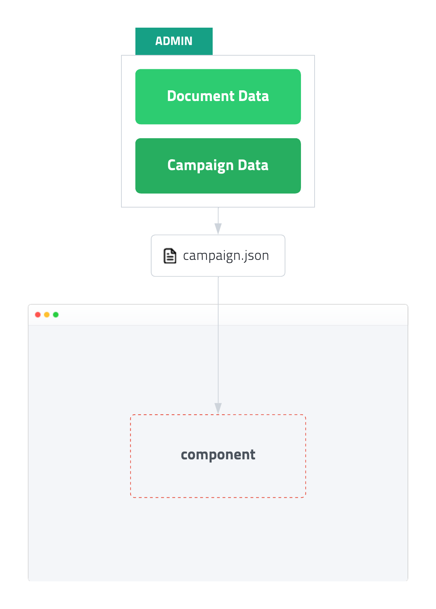
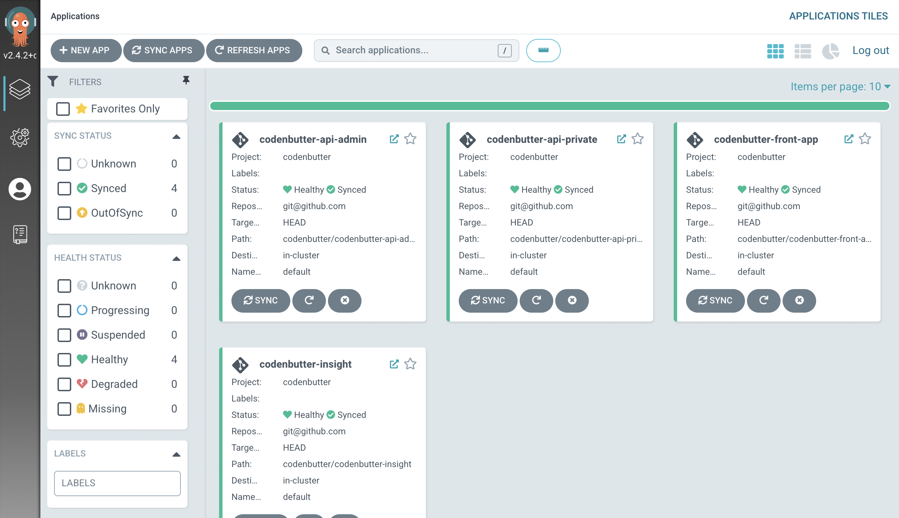

---
head:
  - - meta
    - property: "og:url"
      content: https://docs.codenbutter.com/developer/how-to-work.html
  - - meta
    - property: "og:description"
      content: 동작방식 소개
  - - meta
    - name: "twitter:description"
      content: 동작방식 소개
---

# 동작방식 소개

코드앤버터가 동작하는 방식과 기술적인 내용을 소개합니다.

> 코드앤버터는 퍼플아이오에서 진행했던 프로젝트의 기술들을 조금씩 모아모아모아 시작한 ~~오버엔지니어링~~ 프로젝트입니다.

[[toc]]

::: info
코드앤버터의 상세한 동작 방식을 모르더라도 서비스를 사용하는 데 문제가 없습니다.  
어떻게 동작하는지 궁금한 분을 대상으로 작성한 내용입니다.  
:::

## 동작방식

웹사이트에 스크립트를 삽입하면 외부에서 설정한 기능(팝업, 배너, 게시판 등)이 추가되는 방식입니다.  
구글맵, 카카오 주소 찾기, 구글 애널리틱스와 비슷한 방식으로 복잡한 개발 없이 ~~만들기는 귀찮고~~ 필요한 기능을 하나씩 가져다 사용할 수 있습니다.

<div class="img-480 no-shadow">



</div>

1. 코드앤버터 관리자 페이지에서 캠페인(현재 팝업만 지원)을 생성합니다.
2. 캠페인은 [Document Data](#document-data)와 [Campaign Data](#campaign-data)로 이루어져 있습니다.
3. 캠페인을 공개하면 `campaign.json` 파일이 생성됩니다.
4. 웹페이지에 추가된 Javascript SDK가 설정 파일을 분석하여 컴포넌트를 생성합니다.

## Document Data

컴포넌트를 설계할 때, 커스터마이징과 확장성을 고려하였습니다. 아무리 기능이 좋고 사용하기 쉽더라도 정해진 템플릿만 사용할 수 있고 세부적인 변경이 불가능하다면 범용적인 서비스로 제공하기 어렵다고 생각합니다.

코드앤버터의 컴포넌트 데이터는 여러 개의 `Node`가 `Tree` 형태로 구성되어 완전히 자유롭게 커스터마이징할 수 있습니다. 만약 에디터에서 변경할 수 없다면 그건 에디터의 문제이지 데이터는 열려 있습니다. ~~열심히 에디터 개선 중입니다 ㅠ~~

**노드 종류**

- `Document` - 기본적인 문서 속성을 표현
- `Frame` - 영역 및 레이아웃을 표현하기 위한 노드로 여러 개의 자식 노드를 포함
- `Text` - 글자를 표현하기 위한 노드
- `Image` - 이미지를 표현하기 위한 노드

**트리 형태 샘플**

```
Document
├─ Frame
│  ├─ Frame
│  │  └─ Image
│  └─ Text
├─ Text
└─ ...
```

**이미지 노드 데이터 샘플**

```json
{
  "id": "gut5Boz5ne4D5eFemmThz5",
  "name": "닫기 버튼 이미지",
  "type": "IMAGE",
  "fills": [
    {
      "path": "https://image.codenbutter.com/upload/frame-background/2022/ddf2c011-cc9a-4070-a21c-f241e7d72c79.svg",
      "type": "IMAGE",
      "width": {
        "unit": "px",
        "value": 27
      },
      "height": {
        "unit": "px",
        "value": 27
      },
      "fileType": "svg",
      "scaleMode": "FILL"
    }
  ],
  "width": {
    "unit": "px",
    "value": 42
  },
  "padding": {
    "top": {
      "unit": "px",
      "value": 14
    },
    "left": {
      "unit": "px",
      "value": 14
    },
    "right": {
      "unit": "px",
      "value": 14
    },
    "bottom": {
      "unit": "px",
      "value": 14
    }
  },
  "visible": true,
  "reactions": [
    {
      "action": {
        "type": "CLOSE"
      },
      "trigger": {
        "type": "ON_CLICK"
      }
    }
  ],
  "pluginData": {},
  "alignHorizontal": "RIGHT"
}
```

## Campaign Data

캠페인 데이터는 디자인을 제외한 기본 속성과 노출 조건 등을 가지고 있습니다.

**캠페인 속성**

- `id` - 캠페인 고유 식별자
- `publicId` - 공개적으로 사용하는 아이디
- `name` - 캠페인 이름
- `type` - 캠페인 종류(`POPUP`, ...)
- `schedule` - 노출 기간 설정
- `target` - 노출 조건 설정 (페이지, 사용자, 레퍼러, ...)
- `display` - 노출 방식 설정 (바로 노출, n초 후, 스크롤시, ...)

**노출 조건**

노출 조건은 `AND`, `OR`, `CONDITION`의 `Tree 형태`로 표현합니다.  
다양한 조합을 표현할 수 있습니다.

```json
{
  "type": "OR",
  "value": [
    {
      "type": "AND",
      "value": [
        { "type": "URL", "operator": "STARTS_WITH", "value": "/Product" },
        {
          "type": "OR",
          "value": [
            { "type": "URL", "operator": "INCLUDE", "value": "CODE_1" },
            { "type": "URL", "operator": "INCLUDE", "value": "CODE_2" },
            { "type": "URL", "operator": "INCLUDE", "value": "CODE_3" }
          ]
        }
      ]
    },
    { "type": "URL", "operator": "EQUAL", "value": "/MyPage" }
  ]
}
```

## Javascript SDK

코드앤버터에서 제공하는 스크립트를 웹페이지에 추가하면 캠페인 정보를 조회하고 조건에 맞는 DOM을 생성하여 웹페이지에 삽입합니다.

<div class="img-480 no-shadow">


</div>

**주요 모듈**

- `코어` - 캠페인 데이터 조회 및 분석
- `수집분석도구` - 캠페인 노출 데이터 수집 및 분석
- `컴포넌트 매니저` - DOM을 생성하고 생성한 DOM과 웹사이트 간의 이벤트 송수신 처리
- `컴포넌트` - Svelte 기반 DOM을 렌더링하는 라이브러리

## Architecture

코드앤버터는 Node.js 기반의 Monorepo 프로젝트와 독립된 서비스로 구성되어 있습니다.

```
┌─ App (Monorepo / Node.js / Postgresql)
│  ├─ apps
│  │  ├─ Admin API (GraphQL)
│  │  ├─ Private API (GraphQL)
│  │  ├─ Public API (GraphQL)
│  │  ├─ Component (Svelte)
│  │  ├─ Admin Front (Next.js)
│  │  ├─ Landing Front (Next.js)
│  │  └─ JS SDK (Typescript)
│  └─ shared
│     ├─ API Client (Typescript)
│     ├─ Component Editor (Next.js)
│     └─ Common (utils/types/...)
├─ Insight Service (Spring Boot / MySQL)
├─ Payment Service (Spring Boot / MySQL)
├─ Integration Service (Node.js / MySQL)
└─ Amazon SQS - Lambda (Async Job)
```

핵심 기능(회원, 팀, 웹사이트, 캠페인, 에디터, 렌더링 등)은 App (Monorepo)에서 개발하고 분석(Insight)과 결제(Payment), 외부 서비스 연동(Integration)은 별도 서비스로 분리하여 REST API로 통신합니다.

MSA보다 Monolithic 방식을 선호하지만, 외부 서비스로 제공되는 것과 유사한 형태의 서비스를 자체 개발하는 경우 별도 서비스로 분리하는 것을 고려합니다.

## Test

`수동으로 테스트하는 부분이 있다면, 테스트 코드를 작성하자!` 라는 기준으로 테스트를 진행합니다.

새롭게 추가되는 기능은 브라우저에서 직접 테스트하지만, 이미 작성한 기능은 코드를 리팩토링하거나 라이브러리를 업데이트할 때 덜 고생할 수 있도록 테스트 코드의 도움을 받습니다.

**테스트 방식**

웹페이지에 스크립트를 넣으면 캠페인 설정을 조회하고 팝업을 렌더링한다. →

1. [Playwright](https://playwright.dev/) 이용하여 웹페이지를 띄우고
2. script를 추가한 다음
3. 특정한 DOM 객체가 있는지 체크

공개 중인 캠페인의 노출 조건을 수정하면, campaign.json을 업로드한다. →

1. [Jest](https://jestjs.io/)의 mock 기능을 이용하여 캠페인 공개 여부를 true로 응답하게 설정한 다음
2. 캠페인 노출 조건을 수정하고
3. 업로드 함수를 실행하는지 체크
4. [Jest](https://jestjs.io/)의 mock 기능을 이용하여 캠페인 공개 여부를 false로 응답하게 설정한 다음
5. 캠페인 노출 조건을 수정하고
6. 업로드 함수를 실행하지 않는지 체크

컴포넌트 데이터 속성에 폰트 스타일 속성을 추가하면 에디터(React 기반)와 렌더러(Svelte 기반)에 정상적으로 추가된다. →

1. [Jest](https://jestjs.io/)의 스냅샷 기능과 [Testing Library](https://testing-library.com/)의 컴포넌트 렌더링 기능을 이용하여
2. 폰트 스타일 속성을 추가하고 React와 Svelte 컴포넌트를 생성하고
3. 스냅샷을 찍어서 저장
4. 리팩토링하거나 라이브러리 업데이트시 스냅샷이 변경되지 않았는지 확인

## CI (Continuous Integration)

GitHub을 저장소로 사용하고 Pull Request 시 Jenkins에서 빌드와 테스트를 수행합니다.

<div class="no-shadow">


</div>

열일 중인 Jenkins의 작업 목록입니다. 최종 빌드 결과는 S3에 정적인 파일로 업로드하거나 도커 이미지를 생성합니다.

<div class="no-shadow">


</div>

## CD (Continuous Deployment)

정적인 파일은 S3 → Cloudfront(CDN)로 제공하고, 도커 이미지는 AWS EKS에 배포합니다.  
쿠버네티스 배포는 GitOps를 이용한 ArgoCD를 사용합니다.

<div class="no-shadow">



</div>

Jenkins에서 빌드한 빌드넘버를 GitHub 배포 저장소의 values.yml 파일을 수정하면 자동으로 배포됩니다.

## 이어서..

[더 궁금하신게 있나요?](./recruit)
