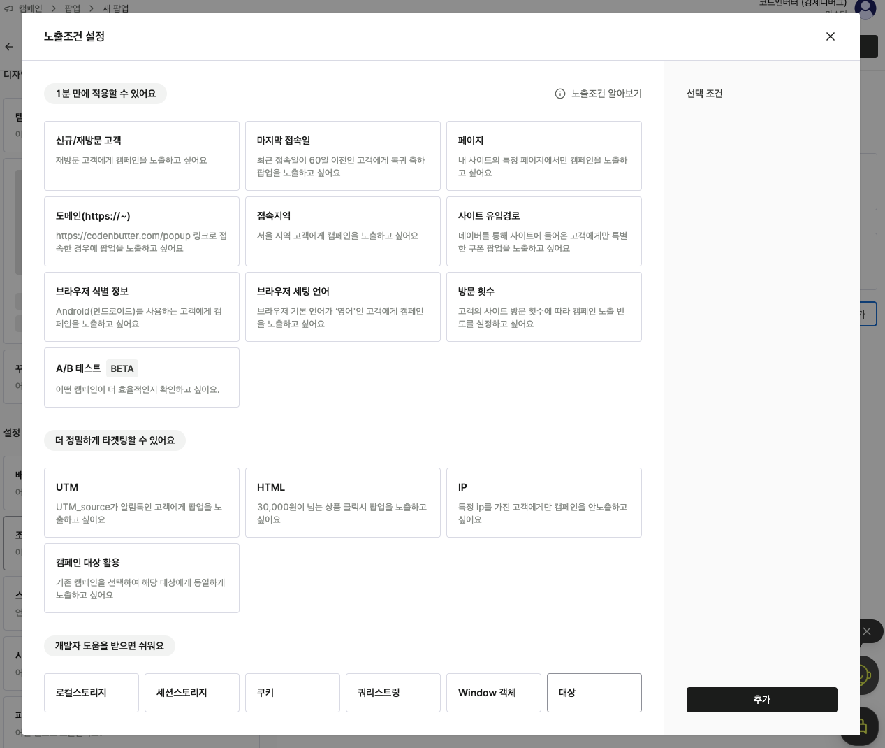
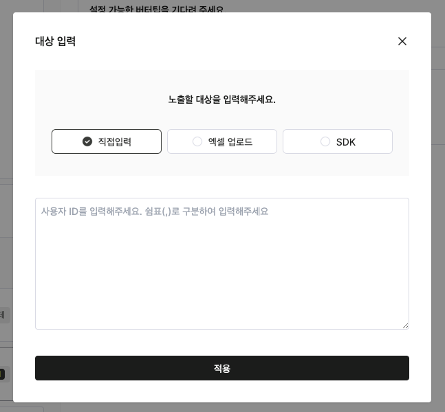

---
head:
  - - meta
    - property: "og:url"
      content: https://docs.codenbutter.com/developer/js-sdk.html
  - - meta
    - name: "twitter:url"
      content: https://docs.codenbutter.com/developer/js-sdk.html
  - - meta
    - property: "og:description"
      content: 코드앤버터 Javascript SDK
  - - meta
    - name: "twitter:description"
      content: 코드앤버터 Javascript SDK
---

# Segment 활용하기

Segment 기능을 활용하면 좀 더 정교한 노출 제어가 가능합니다.

[[toc]]

## 지원캠페인

- 팝업
- 그룹 팝업
- 배너
- 이벤트 폼
- 설문조사

## 준비하기

Segment 기능은 사용자의 고유 식별자를 기반으로 동작합니다.  
로그인 아이디가 "test1"인 사용자와 "test2"인 사용자를 구분하여 관리합니다.
비로그인 사용자는 자체적으로 고유 식별자를 생성하여 관리해야 합니다.

로그인 정보가 있을 경우, 코드앤버터 스크립트 초기화 후 사용자 정보를 설정합니다.

[setUser API](/developer/js-sdk.html#setuser)

```js
CodenButter("setUser", { id: "USER-ID" });
```

## 세그먼트 조건 추가하기

세그먼트는 조건에서 `대상`으로 설정할 수 있습니다.



## 세그먼트 추가하기

세그먼트 추가는 수동(관리자 화면) 또는 SDK 방식을 사용할 수 있습니다.

**수동 관리**

관리자 화면에서 세그먼트를 추가합니다.



**SDK 방식**

[updateTargetSegment API](/developer/js-sdk.html#updatetargetsegment)

```js
CodenButter("updateTargetSegment", {
  campaignId: "CAMPAIGN-ID",
  engageable: true,
});
```

캠페인 노출 후 더이상 노출을 원하지 않으면 세그먼트 참여 불가로 설정합니다.

```js
CodenButter("updateTargetSegment", {
  campaignId: "CAMPAIGN-ID",
  engageable: false,
});
```
