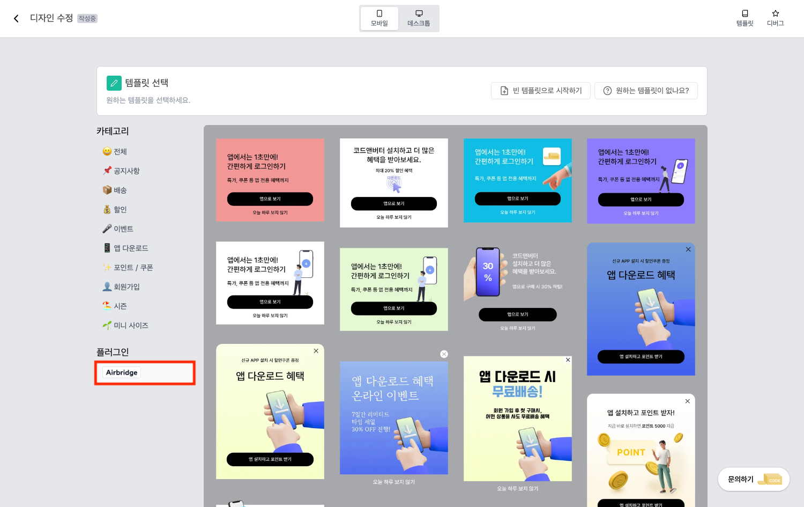
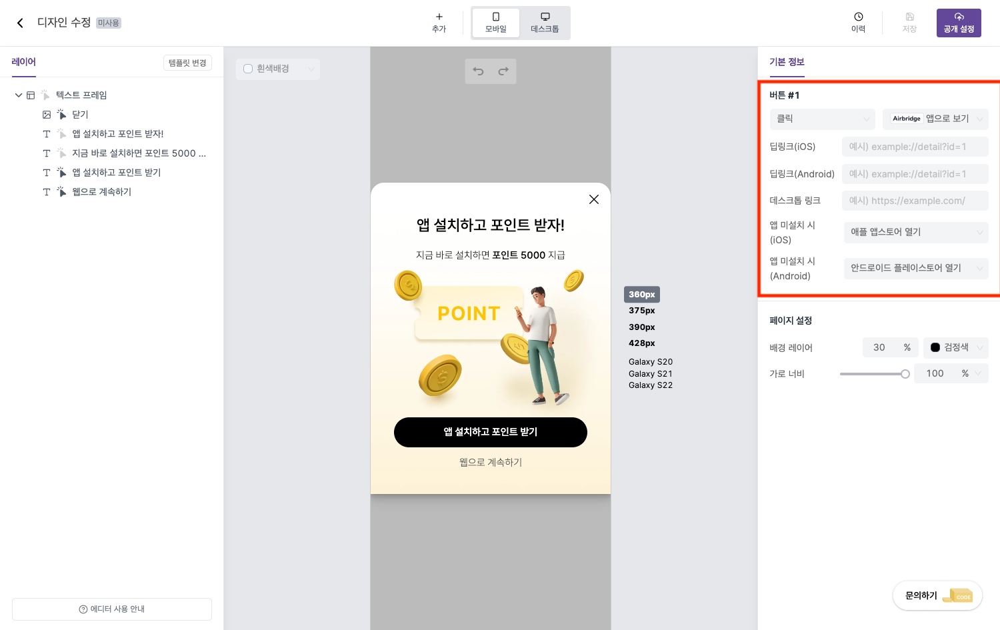

---
head:
  - - meta
    - property: "og:url"
      content: https://docs.codenbutter.com/guide/airbridge.html
  - - meta
    - name: "twitter:url"
      content: https://docs.codenbutter.com/guide/airbridge.html
  - - meta
    - property: "og:description"
      content: 코드앤버터 airbridge
  - - meta
    - name: "twitter:description"
      content: 코드앤버터 airbridge
---

# Airbridge

::: info

코드앤버터 팝업은 Airbridge 기능을 탑재하고 있어서 앱 마켓 링크를 입력해주면 사용자가 Airbidge가  연결된 요소를 클릭할 때,
해당 앱 마켓으로 이동되어 사용자의 모바일 기기에 앱이 다운로드 되는 기능을 제공하고 있습니다.

:::

 

 

::: warning 주의
Airbridge 기능을 사용하기 위해서는 팝업을 적용하고자 하는 사이트에 [Airbridge 스크립트](https://developers.airbridge.io/docs/web-sdk)가 설치되어 있어야 합니다.
:::

## 템플릿 선택

1. 템플릿 선택 화면에서 Airbridge를 선택해줍니다.

::: info 템플릿 선택 화면

- 템플릿 선택 화면으로 이동하는 방법이 궁금하시다면 아래 내용을 참고해주세요.

[에디터로 진입](./enter-editor.md)

:::

2. 표시한 영역에 내용을 입력해주세요.

### 옵션 살펴보기

- 클릭: 요소를 클릭했을 때 동작하는 이벤트를 의미합니다.  
  Airbidge 기능을 사용하기 위해서는 클릭 옵션이 반드시 Airbidge 앱으로 보기로 되어 있어야 합니다.

- 딥링크: 요소를 클릭했을 때, 앱에서 특정 화면으로 이동시켜줍니다. 

- 앱 미설치 시: 앱이 설치가 되지 않아 딥링크가 작동하지 않을 때 지정한 곳으로 이동시켜 줍니다.

::: warning 주의
괄호안에 씌여져 있는 내용(iOS / Android / 데스크톱)에 따라 해당 환경에서만 동작 합니다.  
ex) 딥링크(iOS) : iOS에서만 동작하는 딥링크 설정 입니다.
:::

## 다음 과정이 궁금해요

> [공개](./detail-editor.md#공개)
