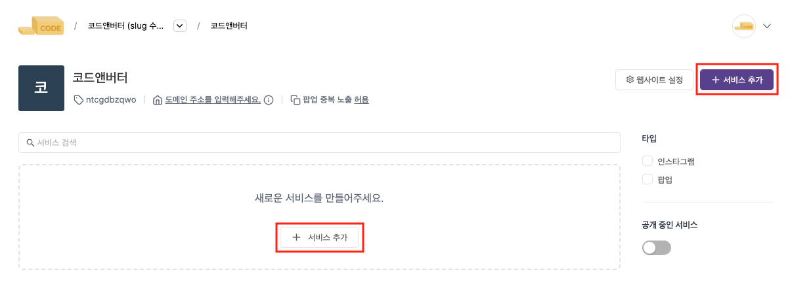
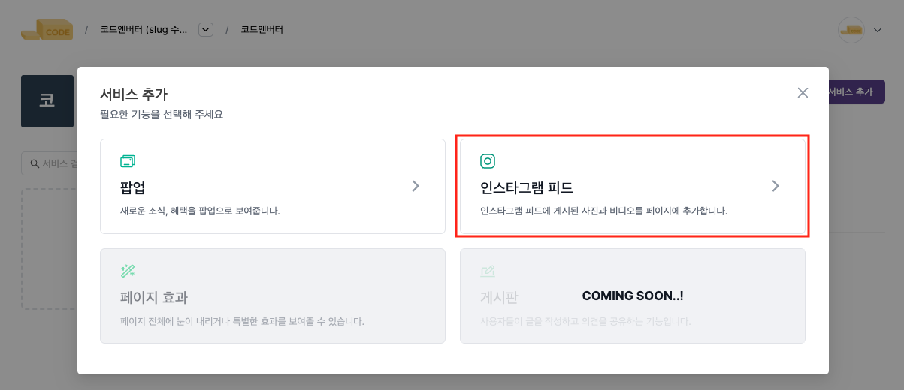
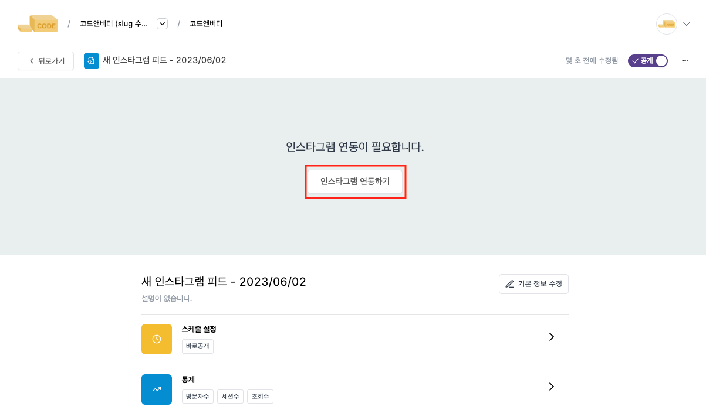
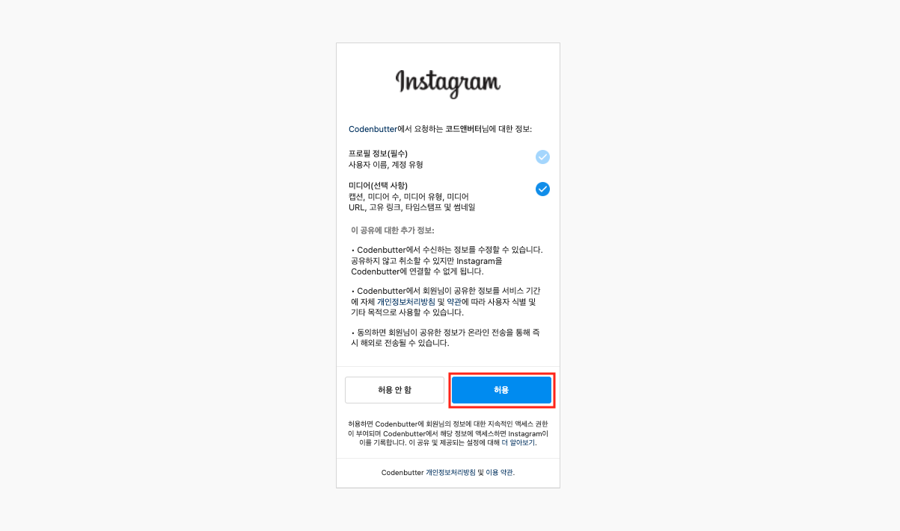
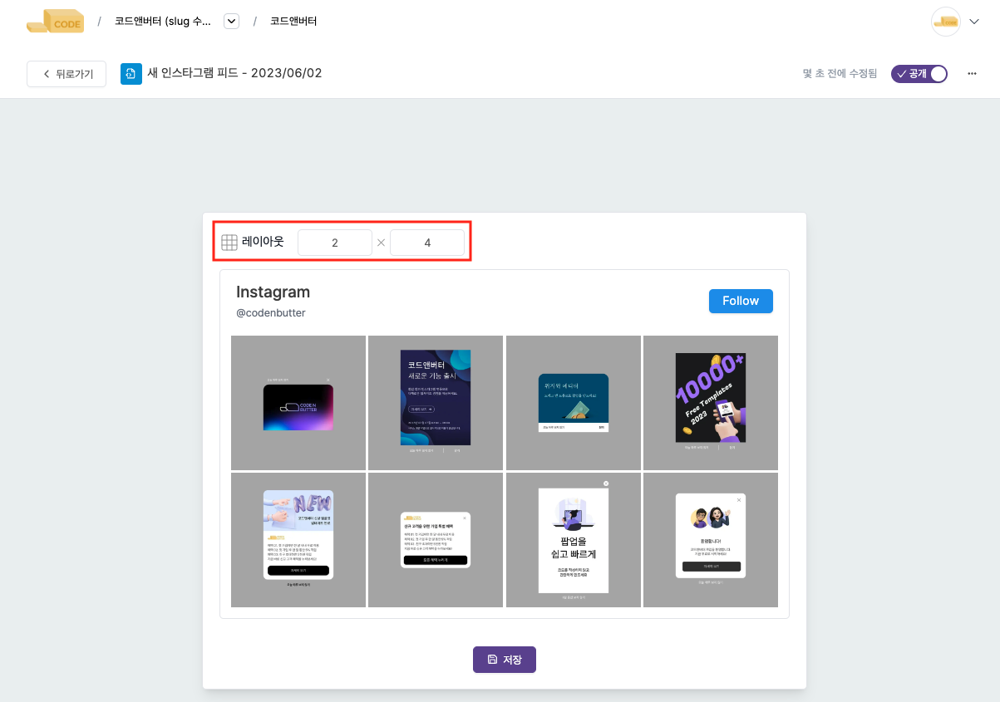
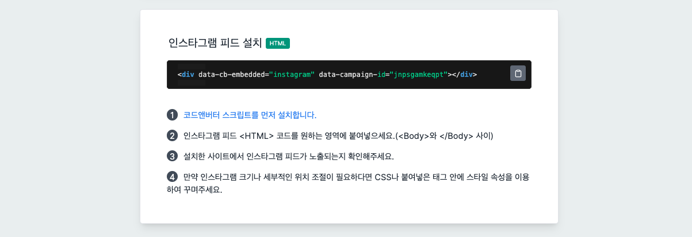

---
head:
  - - meta
    - property: "og:url"
      content: https://docs.codenbutter.com/guide/basic-instagram.html
  - - meta
    - name: "twitter:url"
      content: https://docs.codenbutter.com/guide/basic-instagram.html
  - - meta
    - property: "og:description"
      content: 인스타그램 피드 추가
  - - meta
    - name: "twitter:description"
      content: 인스타그램 피드 추가
---

# 인스타그램 피드 사용하기

인스타그램 피드를 웹사이트에 추가하는 기능입니다.

1. **서비스 추가**에서 **인스타그램 피드**를 선택합니다.

   

   

1. **인스타그램 연동하기**를 선택하고 웹사이트에 추가하고 싶은 인스타그램 계정에 로그인합니다.

   

   

1. 레이아웃을 변경 및 저장한 후, 웹사이트 **HTML의 \<Body> 영역**에 스크립트를 붙여넣어 주세요.

   

   

카페24는 SEO 설정 영역에서, 아임웹은 디자인 모드에서 코드 위젯 추가로 코드앤버터의 인스타그램 기능을 활용할 수 있습니다.
