---
head:
  - - meta
    - property: "og:url"
      content: https://docs.codenbutter.com/guide/campaign.html
  - - meta
    - name: "twitter:url"
      content: https://docs.codenbutter.com/guide/campaign.html
  - - meta
    - property: "og:description"
      content: 코드앤버터 캠페인
  - - meta
    - name: "twitter:description"
      content: 코드앤버터 캠페인
---

# 캠페인 (TODO)

::: info
캠페인에 대한 설명 - 작업중

<!-- TODO -->

:::

 

[[toc]]

## 캠페인 목록 페이지

1. 메인 페이지에서 관리하고자하는 사이트를 선택해줍니다.

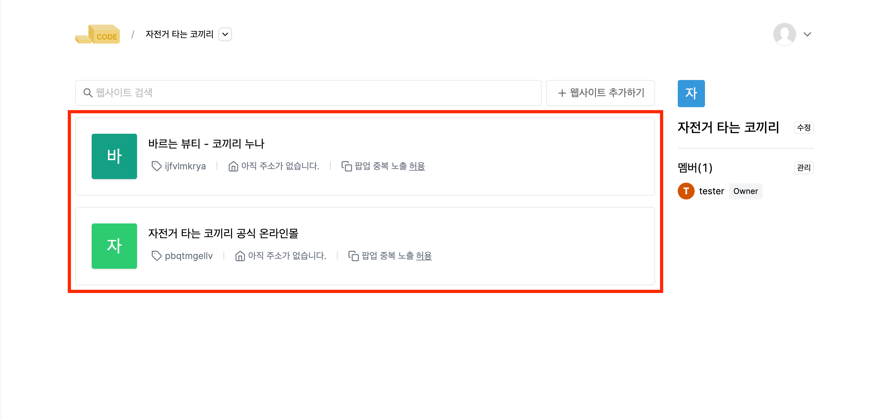

2. 캠페인 목록 페이지로 이동됩니다.

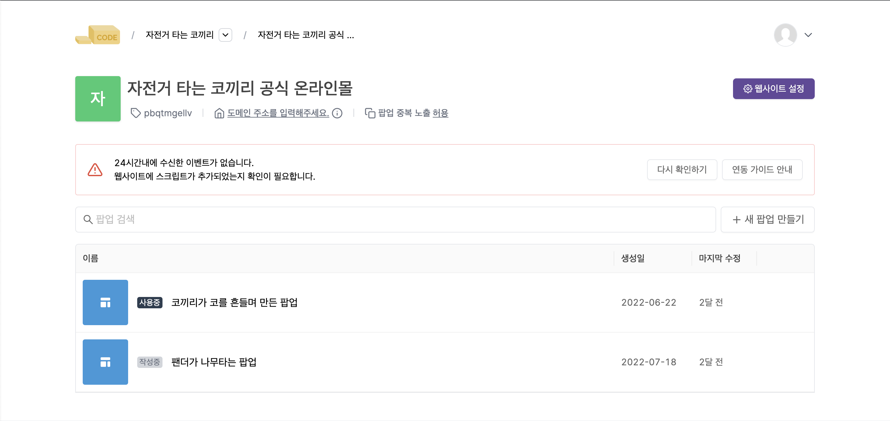

## 캠페인 상세 페이지

1. 캠페인 목록 페이지에서 [캠페인]을 선택해줍니다.

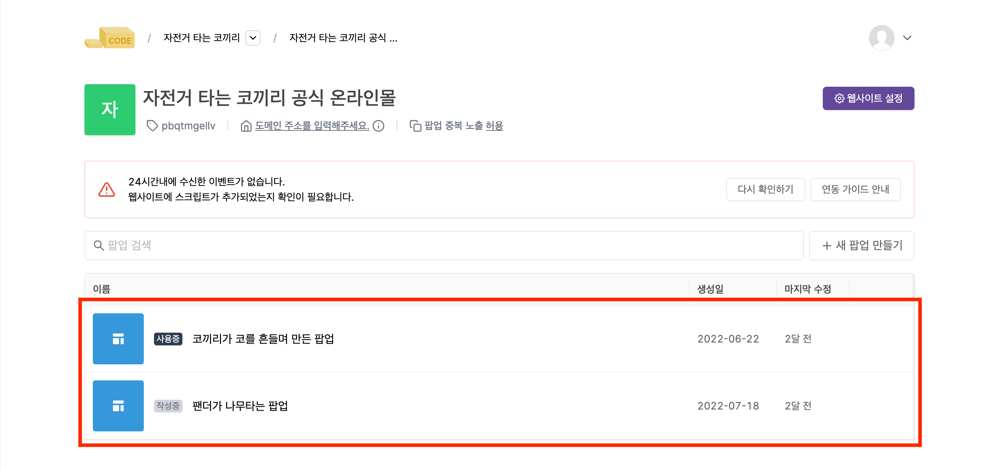

3. 캠페인 상세 페이지로 이동하게 됩니다.

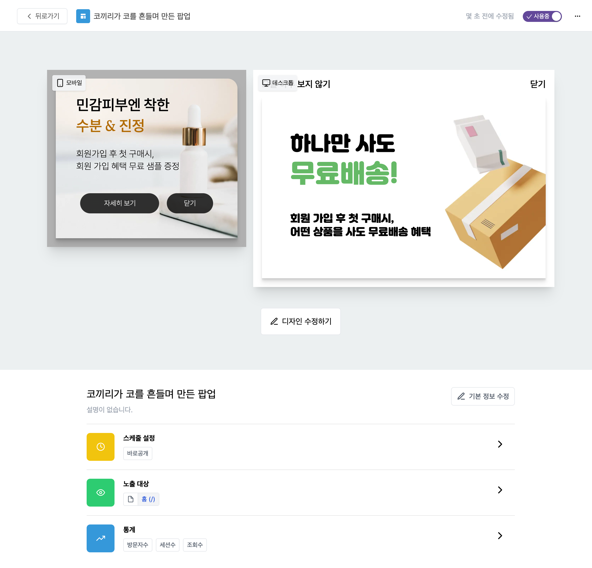

## 노출 대상

### TYPE A] 일반적인 사용법

- 별다른 옵션 조건을 추가하지 않은 상태에서는 기본적으로 홈 경로에 대해서만 팝업을 노출하고 있습니다.

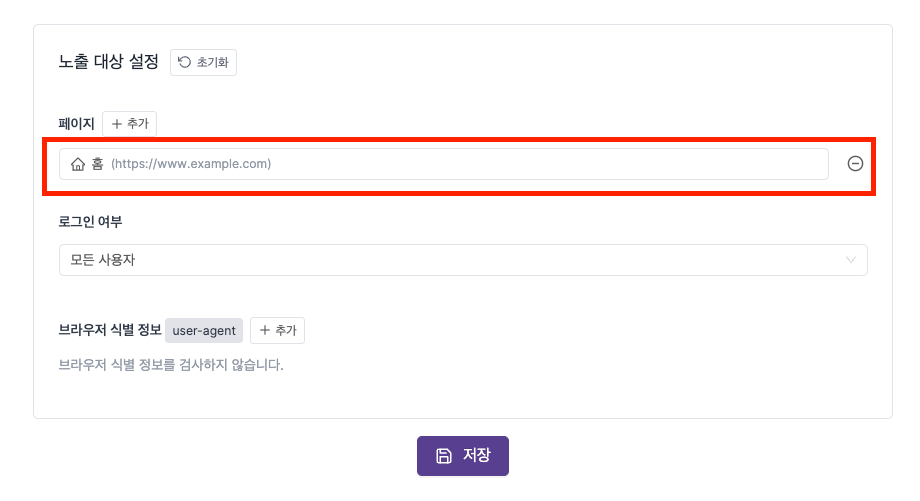

#### 모든 페이지에 팝업을 노출하고 싶어요

- [노출 대상 설정] >> [페이지]에서 [홈]을 제거해준 후 저장을 누릅니다.

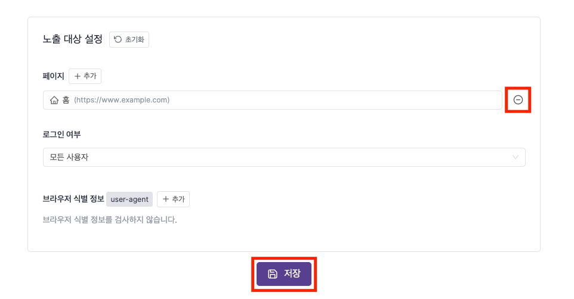

- 모든 페이지에서 노출되도록 설정이 변경됩니다.

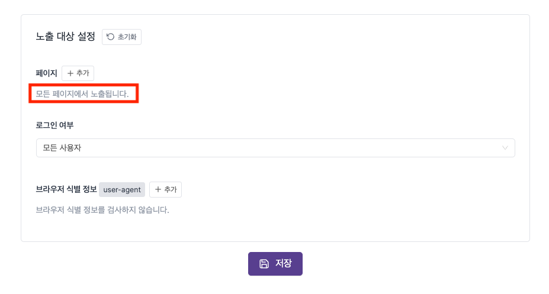

#### 페이지 경로를 잘못 입력한 경우

#### 페이지 경로를 올바르게 입력한 경우

> 홈 경로를 제외하고 /로 시작하는 형식으로 입력해주세요.

#### 페이지 경로에 조건을 주어 설정하고 싶은 경우

- [일치]를 눌러서 원하는 옵션을 선택해줍니다.

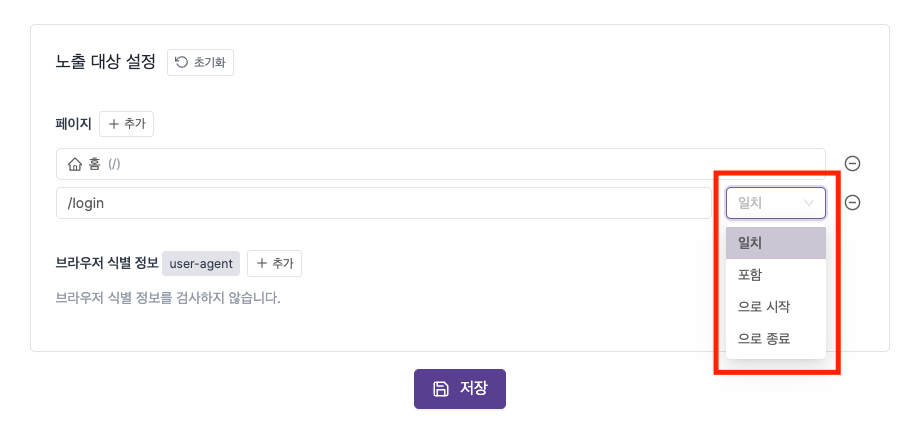

#### 페이지 경로를 여러개 입력하고 싶은 경우

- [+ 추가] 버튼을 눌러 새로운 페이지 경로를 입력해줍니다.
- 우측에 노란색으로 표시한 [- 아이콘]을 누르면 기존 페이지 경로를 제거할 수 있습니다.

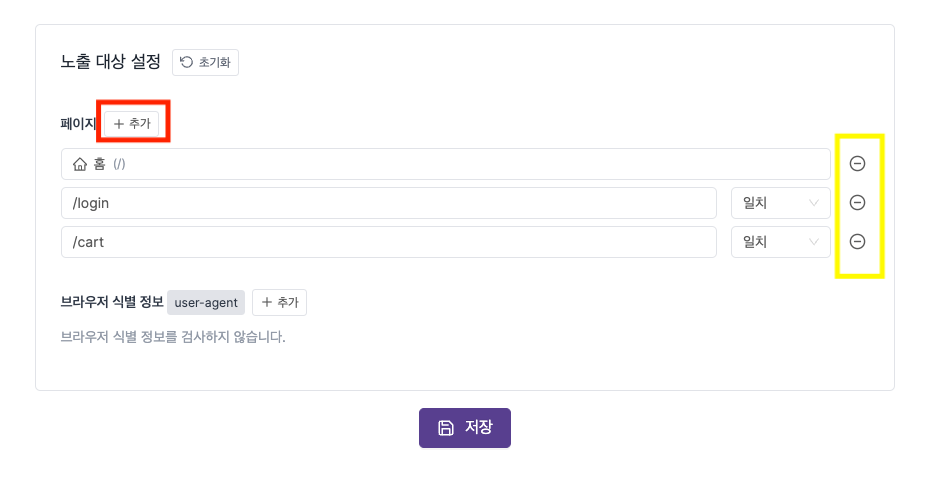

#### 특정 페이지에 팝업을 노출하고 싶어요

- [+ 추가]를 누릅니다.

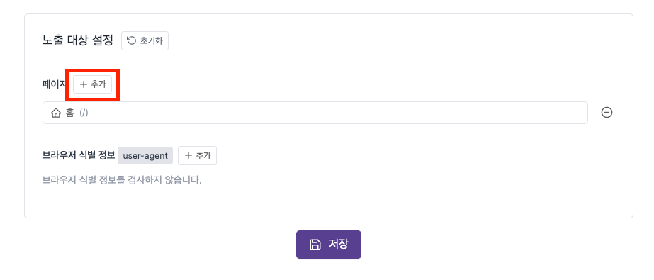

- [직접 입력]을 누릅니다.

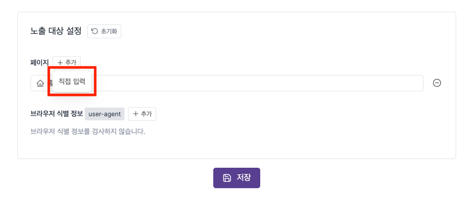

### TYPE B] 서비스 연동을 사용하는 경우

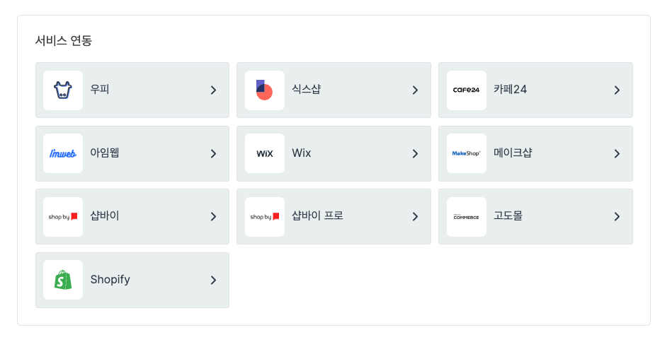

- 아래 이미지에 해당하는 서비스를 이용해서 만든 웹사이트를 사용할 경우,  
  노출 페이지에 대해 직접 입력하는 번거로움을 덜어드리고자 노출 페이지 설정을 옵션에서 선택하는 방식으로 제공해드리고 있습니다.

- 예를 들어 ~~~~~ (TODO)

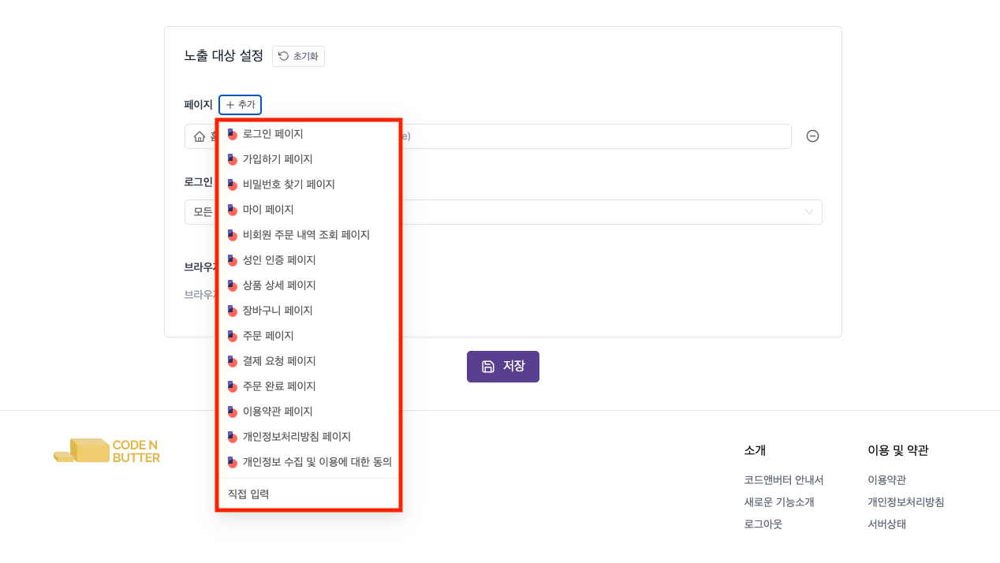

### 브라우저 식별 정보 (TODO)

- 개념 / 활용예제 - airbridge

- 브라우저 식별 정보는 웹 개발에 대한 배경지식이 있는 사용자를 위한 고급기능으로 브라우저, 접속 기기 등 사용자를 식별하고자 할때 사용

1. [+ 추가]를 누릅니다.

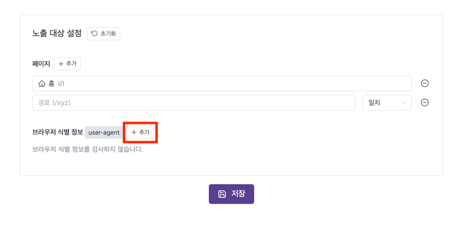

## 스케줄 설정

1. 캠페인 상세 페이지에서 하단에 위치한 [스케줄 설정]을 눌러줍니다.

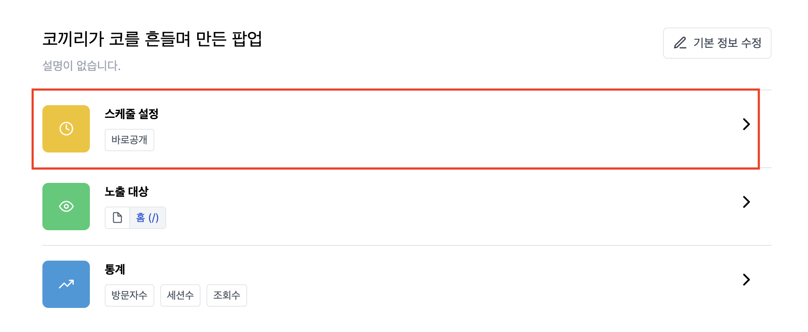

### 바로공개

> 바로공개는 기본값으로 별다른 스케줄 설정없이 사용하고 싶은 때 이용합니다.

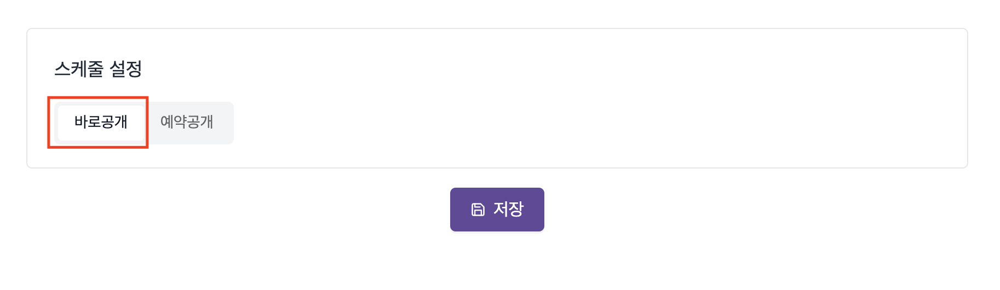

### 예약공개

> 예약공개는 특정 날짜와 시간에만 노출하고 싶을 때 이용합니다.

1. [예약공개]를 누릅니다.

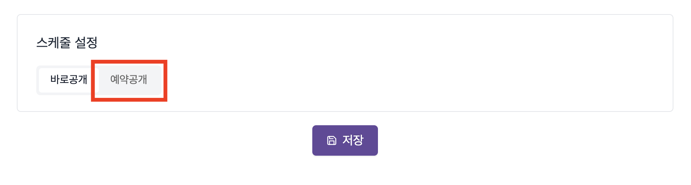

2. [시작일시]와 [종료일시] 입력해줍니다.

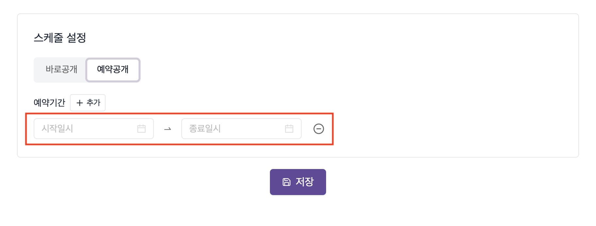

::: warning
날짜를 선택하고나서 [OK]를 반드시 눌러주어야 날짜가 확정됩니다.

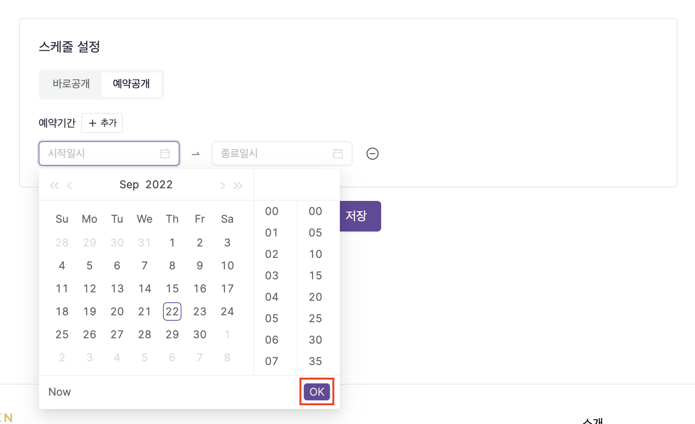

:::

3. [저장]을 눌러줍니다.

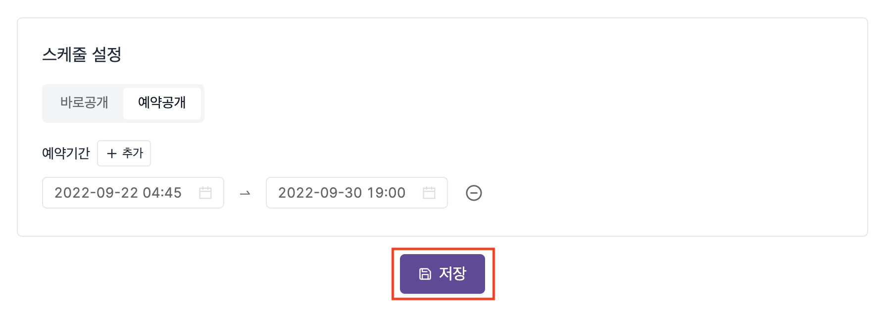

#### Q) 예약기간을 여러개 설정 할 수 있나요?

[+ 추가]를 눌러서 원하는 형태의 기간을 선택하면 예약기간을 세밀하게 설정할 수 있습니다.

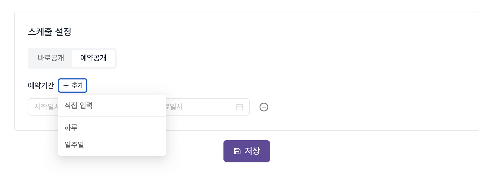

## 통계

1. 캠페인 상세 페이지에서 하단에 위치한 [통계]를 눌러줍니다.

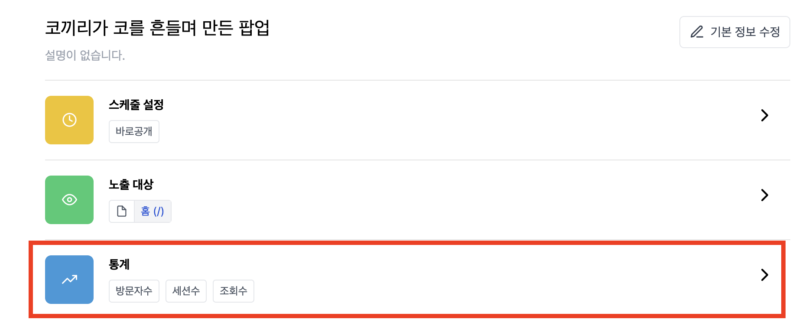

2. 캠페인 접속 통계가 보여집니다.

### 방문자수 vs 세션수 vs 조회수 무엇이 다른가요?

::: details 자세히 알아보기

#### 방문자수  

- 사이트에 유입된 인원 수를 의미합니다.

#### 특징

- 사이트를 나갔다가 재방문해도 같은 사용자라고 보기 때문에 방문자 수가 증가하지 않으나 날짜를 기준으로 방문자수를 구분하기 때문에 날짜가 지난 후에는 해당 날짜에 대해서는 새로운 방문자로 집계됩니다.

#### 세션수  

- 사용자가 사이트를 방문하면 사용자들을 식별하는 세션이 형성됩니다.

#### 특징

- 세션이 유지되고 있는 특정 시간동안은 재방문시 같은 방문자로 인식합니다.
- 세션이 유지되는 기간동안은 재방문을 하더라도 새로운 방문자로 집계되지 않습니다.
- 반면에 사용자가 사이트에 방문 후 오랜시간 동안 별다른 행동을 취하지 않거나 사이트를 이탈한지 오래된 후 재방문을 하면 새로운 세션이 형성되고 새로운 방문자로 인식해서 집계됩니다.

#### 조회수:  

- 사용자 1명이 캠페인에 여러번 노출될 수 있기 때문에 실제 방문자 수 보다 조회수가 높은 경우가 많습니다.

:::

### 사이트 통계와 캠페인 통계는 무엇이 다른가요?

::: details 자세히 알아보기

#### 사이트 통계  

- 사용자가 사이트를 방문 했을 때 통계 수치에 집계 됩니다.

#### 캠페인 통계  

- 사용자가 캠페인에 노출되었을 때 통계 수치에 집계 됩니다.

#### 특징

- 사용자가 사이트를 방문하더라도 특정 페이지나 특정 시간대에만 캠페인이 노출되 있다면 사이트를 방문하더라도 캠페인은 통계 수치에 집계되지 않습니다.

<!-- TODO -->
<!-- 사이트 통계 살펴보기 (링크이동) -->

::::

## 캠페인 정보 수정

1. 기본 정보 수정을 누릅니다.

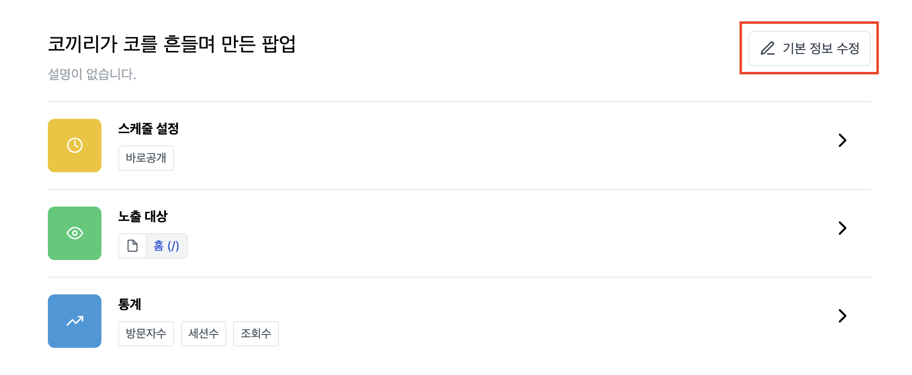

1. 이름과 설명을 변경하고 나서 [저장]을 누릅니다.

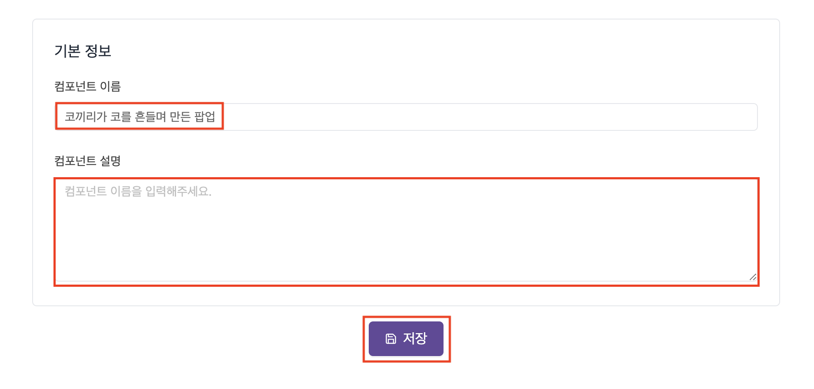

## 캠페인 복제와 삭제

- 캠페인 목록에서 삭제할 캠페인에 마우스를 대면 [복제]와 [삭제] 버튼이 나타납니다.

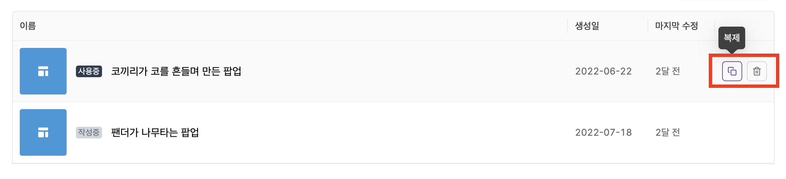

### 캠페인 복제

::: info

현재 캠페인이 속한 사이트 뿐만 아니라 다른 사이트로도 복제가 가능합니다.

:::

1. [복제]를 눌러주세요.

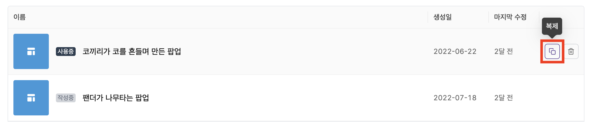

2. 모달창이 열린 상태에서 [대상 사이트] 영역을 누릅니다.

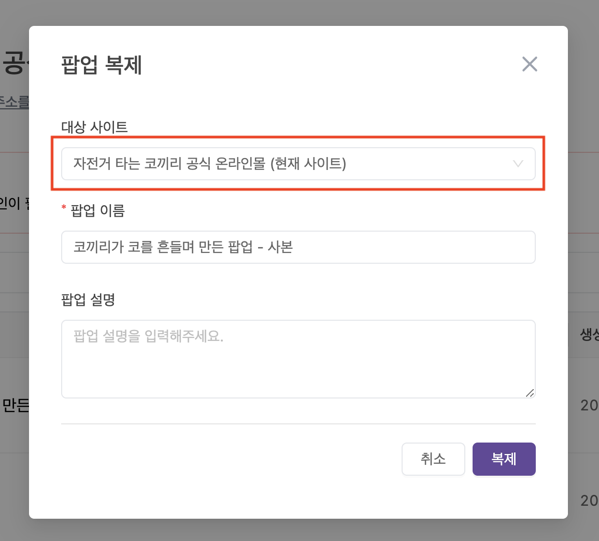

3. 복제된 캠페인을 적용할 사이트를 선택해 주고 [복제]를 누릅니다.

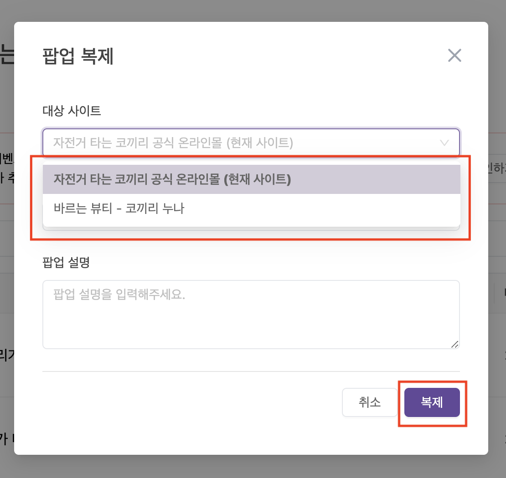

4. 선택한 사이트의 캠페인 목록 페이지로 이동되며 복제된 캠페인이 화면상에 나타납니다.

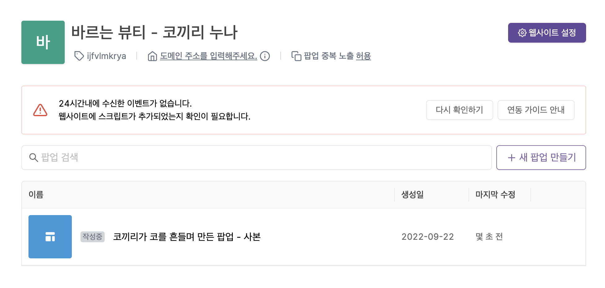

### 캠페인 삭제

1. 삭제할 캠페인에 마우스를 올리고 [삭제]를 눌러주세요.

2. [삭제]를 눌러주세요.

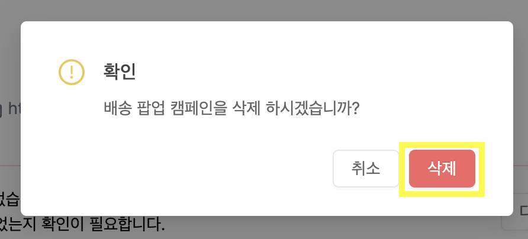

## 캠페인 활성화와 사용 중지

- 캠페인 목록 페이지에서는 캠페인이 활성화된 상태인지 아닌지 한눈에 보이기 때문에 관리하는데 용이합니다.
- 활성상태를 변경하고 싶다면 목록에서 캠페인을 선택해서 캠페인 상세 페이지로 이동해줍니다.

### 사용 중지

1. 캠페인 상세 페이지 우측상단에 위치한 활성상태 영역에서 [사용중]을 눌러줍니다.

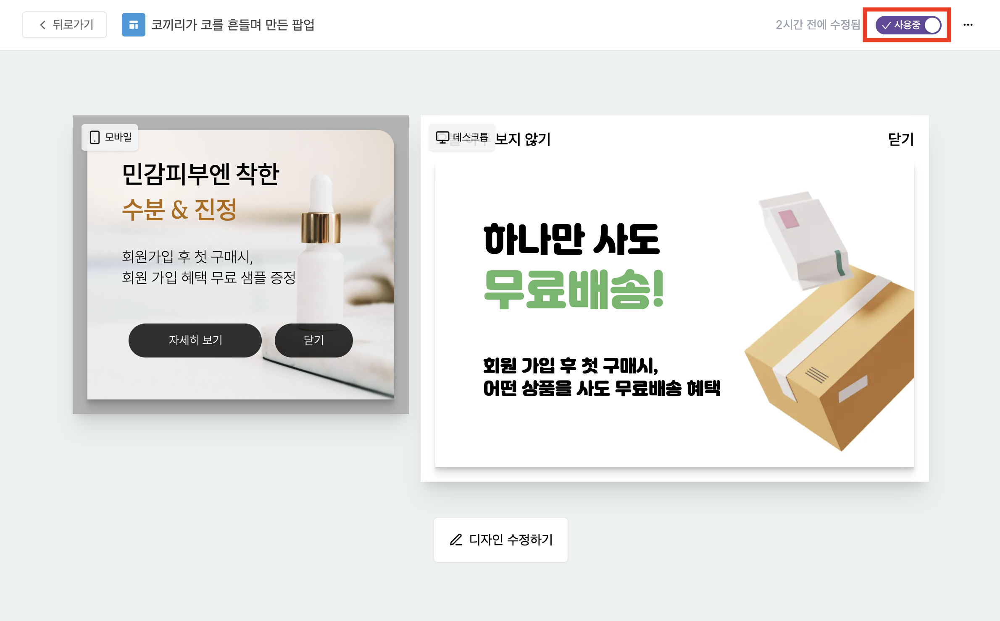

2. [중지]를 눌러줍니다.

3. 캠페인 목록 페이지에서 해당 캠페인이 [미사용]으로 변경됩니다.

### 활성화

1. 캠페인 상세 페이지 우측상단에 위치한 활성상태 영역에서 [미사용]을 눌러줍니다.

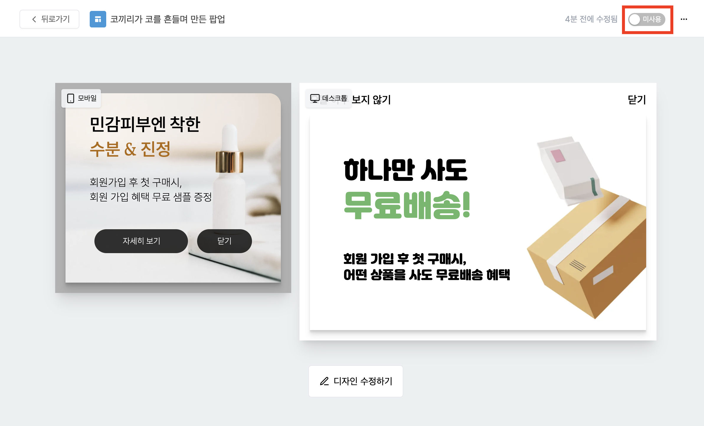

2. [공개]를 눌러줍니다.

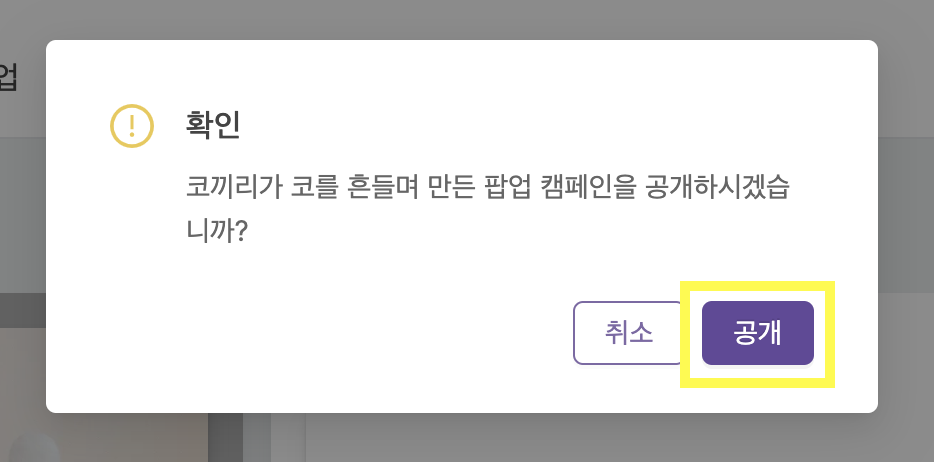

3. 캠페인 목록 페이지에서 해당 캠페인이 [사용중]으로 변경됩니다.

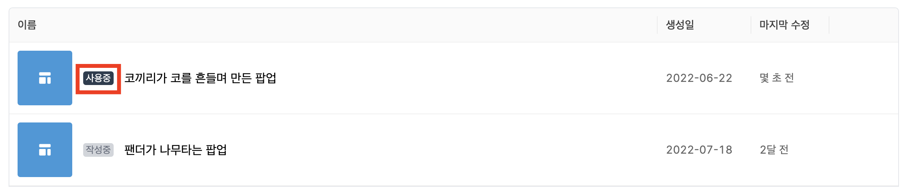
