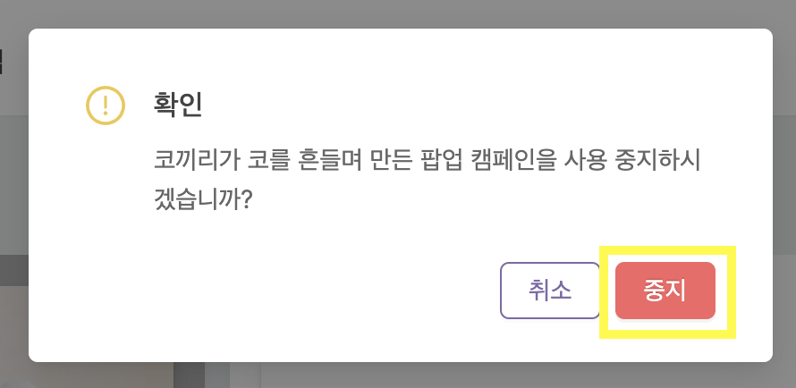
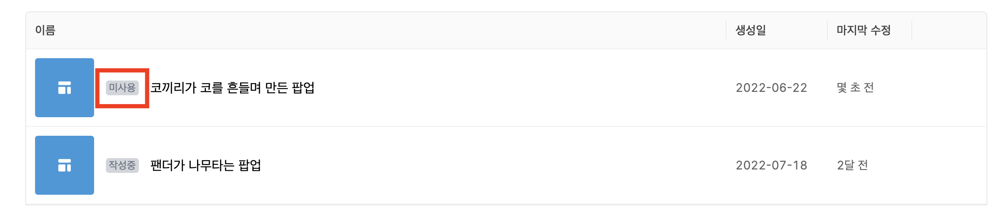

---
head:
  - - meta
    - property: "og:url"
      content: https://docs.codenbutter.com/guide/campaign.html
  - - meta
    - name: "twitter:url"
      content: https://docs.codenbutter.com/guide/campaign.html
  - - meta
    - property: "og:description"
      content: 코드앤버터 캠페인
  - - meta
    - name: "twitter:description"
      content: 코드앤버터 캠페인
---

# 캠페인 (TODO)

::: info
캠페인에 대한 설명
:::

 

[[toc]]

## 캠페인 목록 페이지

1. 메인 페이지에서 관리하고자하는 사이트를 선택해줍니다.

2. 캠페인 목록 페이지로 이동됩니다.

## 캠페인 상세 페이지

1. 캠페인 목록 페이지에서 [캠페인]을 선택해줍니다.

3. 캠페인 상세 페이지로 이동하게 됩니다.

## 노출 대상

<!-- TODO -->

## 스케줄 설정

1. 캠페인 상세 페이지에서 하단에 위치한 [스케줄 설정]을 눌러줍니다.

### 바로공개

> 바로공개는 기본값으로 별다른 스케줄 설정없이 사용하고 싶은 때 이용합니다.

### 예약공개

> 예약공개는 특정 날짜와 시간에만 노출하고 싶을 때 이용합니다.

1. [예약공개]를 누릅니다.

2. [시작일시]와 [종료일시] 입력해줍니다.

::: warning
날짜를 선택하고나서 [OK]를 반드시 눌러주어야 날짜가 확정됩니다.

:::

3. [저장]을 눌러줍니다.

#### Q) 예약기간을 여러개 설정 할 수 있나요?

[+ 추가]를 눌러서 원하는 형태의 기간을 선택하면 예약기간을 세밀하게 설정할 수 있습니다.

## 통계

1. 캠페인 상세 페이지에서 하단에 위치한 [통계]를 눌러줍니다.

2. 캠페인 접속 통계가 보여집니다.

<!-- TODO -->

> 방문자수 vs 세션수 vs 조회수 무엇이 다른가요?

<!-- 세션 시간 기준
https://clover7-webnote.tistory.com/245 내용 참고
 -->

> 사이트 통계와 캠페인 통계는 무엇이 다른가요?

<!-- TODO -->
<!-- 사이트 통계 살펴보기 (링크이동) -->

## 캠페인 정보 수정

1. 기본 정보 수정을 누릅니다.

1. 이름과 설명을 변경하고 나서 [저장]을 누릅니다.

## 캠페인 복제와 삭제

- 캠페인 목록에서 삭제할 캠페인에 마우스를 대면 [복제]와 [삭제] 버튼이 나타납니다.

### 캠페인 복제

::: info

현재 캠페인이 속한 사이트 뿐만 아니라 다른 사이트로도 복제가 가능합니다.

:::

1. [복제]를 눌러주세요.

2. 모달창이 열린 상태에서 [대상 사이트] 영역을 누릅니다.

3. 복제된 캠페인을 적용할 사이트를 선택해 주고 [복제]를 누릅니다.

4. 선택한 사이트의 캠페인 목록 페이지로 이동되며 복제된 캠페인이 화면상에 나타납니다.

### 캠페인 삭제

1. 삭제할 캠페인에 마우스를 올리고 [삭제]를 눌러주세요.

2. [삭제]를 눌러주세요.

## 캠페인 활성화와 사용 중지

- 캠페인 목록 페이지에서는 캠페인이 활성화된 상태인지 아닌지 한눈에 보이기 때문에 관리하는데 용이합니다.
- 활성상태를 변경하고 싶다면 목록에서 캠페인을 선택해서 캠페인 상세 페이지로 이동해줍니다.

### 사용 중지

1. 캠페인 상세 페이지 우측상단에 위치한 활성상태 영역에서 [사용중]을 눌러줍니다.

2. [중지]를 눌러줍니다.

3. 캠페인 목록 페이지에서 해당 캠페인이 [미사용]으로 변경됩니다.

### 활성화

1. 캠페인 상세 페이지 우측상단에 위치한 활성상태 영역에서 [미사용]을 눌러줍니다.

2. [공개]를 눌러줍니다.

3. 캠페인 목록 페이지에서 해당 캠페인이 [사용중]으로 변경됩니다.

