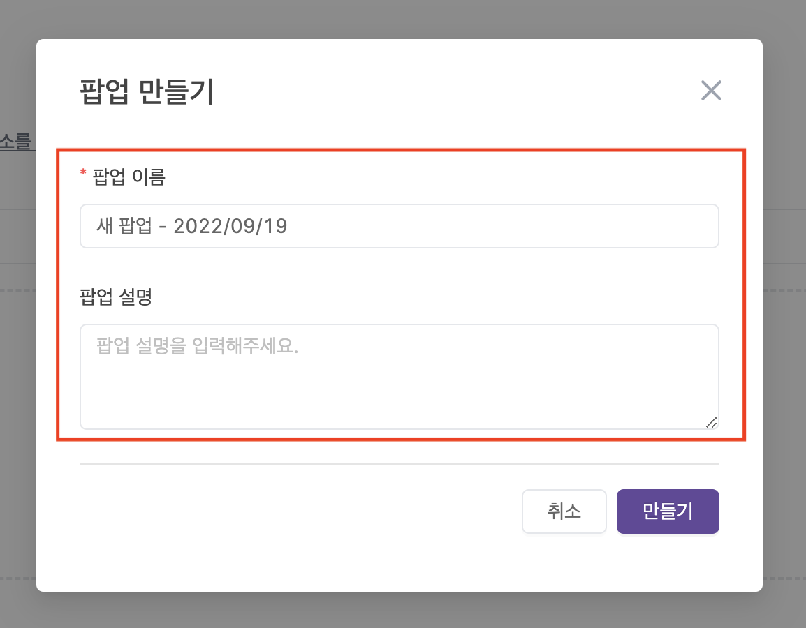
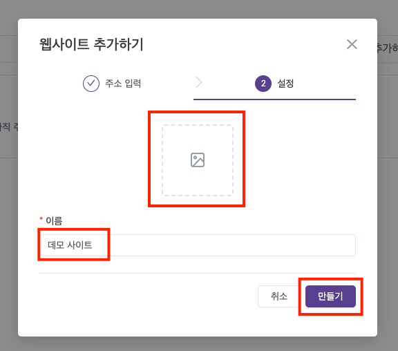

---
head:
  - - meta
    - property: "og:url"
      content: https://docs.codenbutter.com/guide/create-campaign.html
  - - meta
    - name: "twitter:url"
      content: https://docs.codenbutter.com/guide/create-campaign.html
  - - meta
    - property: "og:description"
      content: 코드앤버터 캠페인 만들기
  - - meta
    - name: "twitter:description"
      content: 코드앤버터 캠페인 만들기
---

# 캠페인 만들기

::: info 작업 순서
로그인을 했는데 막상 무엇부터 해야할지 헷갈리신가요? 
[팀 >> 사이트 >> 캠페인] 순으로 등록이 되어야 팝업을 제작할 수 있습니다.

아래 과정을 참고하셔서 캠페인을 만들어보세요.
:::

 

[[toc]]

## 팀

- 구성원들과 함께 협업으로 관리할 수 있는 기능들을 제공합니다.
  > 기능) 멤버 추가 / 권한 변경   [자세히 알아보기](./team.md)

### 팀 생성

- 처음 로그인을 하면 팀을 생성하는 페이지로 이동됩니다.
- 팀 이름을 입력하고 만들기를 눌러줍니다.

## 사이트

- 팝업을 노출할 사이트를 의미합니다.
  > 기능) 스크립트 설치 / 팝업 중복 노출 제한 / 접속 통계   [자세히 알아보기](./site.md)

### 사이트 생성

1. 웹사이트 추가하기 버튼을 눌러 줍니다.

2. 웹사이트 정보를 등록해 줍니다.

- TYPE A]
  > 팝업을 적용할 사이트 주소를 넣고 [다음] 버튼을 눌러주세요.

- TYPE B]
  > 사이트 주소를 나중에 입력하고 싶을 때 사용하는 기능입니다.  
  > TYPE A를 따라하신 경우라면 이 과정은 건너 뛰어주세요.

3. 사이트의 이미지를 등록하고, 사이트 명을 정해주고 [만들기] 버튼을 눌러줍니다.

## 캠페인

- 팝업을 제작하고 노출 전략을 설정합니다.
  > 기능) 팝업 복제 / 스케줄 설정 / 노출 대상 설정 / 통계   [자세히 알아보기](./campaign.md)

### 캠페인 생성

1. 팝업 만들기 버튼을 눌러 줍니다.

2. 팝업 정보를 작성해 줍니다.

### 다음 과정이 궁금해요

> [템플릿에 대해 알아보기](./select-template.md)
