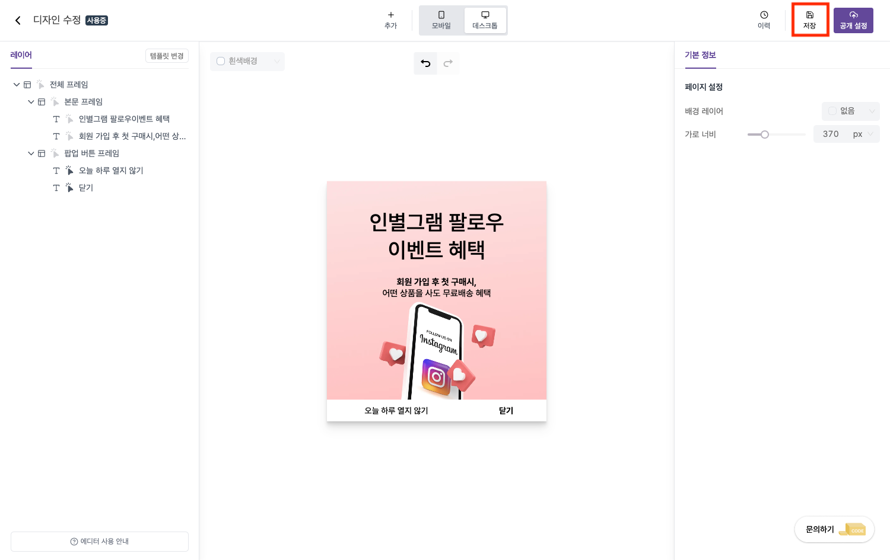
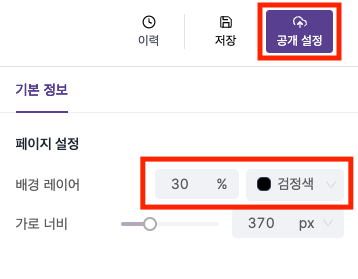

---
head:
  - - meta
    - property: "og:url"
      content: https://docs.codenbutter.com/guide/detail-editor.html
  - - meta
    - name: "twitter:url"
      content: https://docs.codenbutter.com/guide/detail-editor.html
  - - meta
    - property: "og:description"
      content: 코드앤버터 에디터 기능
  - - meta
    - name: "twitter:description"
      content: 코드앤버터 에디터 기능
---

# 에디터 기능

::: info
에디터 사용법에 대한 자세한 내용
:::

 

[[toc]]

## 다른 템플릿을 선택하고 싶어요

- 이미 템플릿을 선택한 상태에서 다른 템플릿으로 변경하고 싶을 때 사용합니다.

1. 좌측 상단에서 [템플릿 변경]을 누릅니다.

2. [이동]을 누릅니다.

::: warning 작업 내용 초기화

- 템플릿을 변경하면 작업중이던 내용이 사라지기 때문에 작업 내용을 보존하고 싶다면 [저장]을 누른 후에 템플릿 변경 과정을 진행해 주세요.

[저장 기능 알아보기](./detail-editor.md#저장)
:::

## 요소 추가

- 새로운 컨텐츠를 만드는데 사용됩니다.

1. [+ 추가]를 누르면 새롭게 생성할 내용들이 보입니다.
2. 원하는 요소를 선택합니다.

## 여백을 조정하고 싶어요

1. 여백을 조정할 영역을 선택하면 아래와 같이 여백을 조정할 수 있는 구분선이 보입니다.

2. 구분선에 마우스를 가져다대면 빗금 무늬가 보이고 여백의 크기가 표시됩니다.

3. 원하는 방향으로 마우스를 드래그 해줍니다. 이때 세로방향으로 여백을 늘려주면 컨텐츠 요소의 높이를 조절하는 효과가 발생합니다.

## 미리보기를 지원하나요?

- [공개 설정]을 누르면 미리보기 화면으로 이동됩니다.
- 미리보기 화면에서는 애니메이션을 적용하여 팝업에 움직임을 주거나 노출 위치 등을 설정할 수 있습니다.

### 팝업이 가려져요

- 팝업을 노출시키다 보면 기존 요소들(다른 팝업, 챗봇 등)에 의해 노출 영역이 겹쳐질 수 있습니다.
- 이 경우, 미리보기 화면에서 [순서]를 변경하면 팝업을 뒤로 위치시키거나 앞으로 끌어올 수 있습니다.

::: info
웹에 대한 배경지식이 있는 분들이라면 z-index를 이용하면 좀더 세밀한 위치 조정이 가능해집니다.  
입력값은 숫자를 넣으시면 됩니다.
:::

## 변경사항을 되돌릴 수 있는 방법이 있나요?

### 실행 취소 / 다시 실행

- 상단에 표시한 아이콘을 클릭하거나 단축키를 이용하면 변경사항에 대해 되돌릴 수 있습니다.
  > 단축키:  
  > 실행 취소 (Ctrl+Z)  
  > 다시 실행 (Ctrl+ Shift+ Z)

### 저장

- [이력] 기능과 함께 사용되는 기능으로 [저장]을 누른 시점별로 히스토리를 만들 수 있습니다.

### 이력

- 이력 목록에서 각 항목을 선택하면 해당 이력이 저장된 시점으로 작업내용이 되돌려집니다.
- 체크 표시된 것은 가장 최근에 저장된 이력을 의미하고 공개함으로 표시된 것은 사이트에 실제로 노출된 팝업 내용을 의미합니다.

## 배경 색상과 배경 레이어의 색상은 무엇이 다른가요?

### 배경

- 고객에게는 노출되지 않고 에디터 화면에서만 작업할 때 시각적으로 작업 영역을 구분하고자 할 때 사용되는 기능입니다.
- 미리보기 화면에서도 적용이 안되는 것을 볼 수 있습니다.

### 배경 레이어

- 고객에게도 노출되는 것으로 미리보기 화면에서 동일하게 적용이 됩니다.
- 배경 레이어 색상 선택 후, [공개설정]을 누르면 미리보기 화면으로 이동됩니다.

## 특정 요소를 없애고 싶어요

- 템플릿 자체는 마음에 드는에 상황에 따라 특정 요소만 빼고 사용하고 싶을 때가 생길 수 있습니다.
- [오늘 하루 열지 않기] 버튼을 삭제하고 싶다는 시나리오를 가정하고 내용을 따라가볼게요.

1. 삭제할 요소를 선택합니다.

2. 좌측에 하이라이트된 곳에 마우스를 올려보면 보이는 삭제 아이콘을 누릅니다.

3. 원하는대로 버튼은 삭제되었지만 공간이 많이 남아 이상해보입니다.

4. 크기를 조정하고 싶은 요소를 선택합니다.

- 가로 너비가 절반정도만 차지해서 반은 공간이 여백으로 차 있는 상태입니다.

5. 가로 너비를 조정해 줍니다.

## 가로 너비를 조정하고 싶어요

### 전체 프레임의 가로 너비를 조정하기

- 좌측에 위치한 컨트롤바를 조정하거나 우측에 숫자를 변경하면 팝업의 전체 가로 너비가 변경됩니다.

### 개별 요소의 가로 너비를 조정하기

- [특정 요소를 없애고 싶어요] 섹션에서 [4번 ~ 5번 내용](./detail-editor.md#특정-요소를-없애고-싶어요)을 참고해주세요.

## 세로 너비를 조정하고 싶어요

- [[여백을 조정하고 싶어요]](./detail-editor.md#여백을-조정하고-싶어요) 내용을 참고해주세요.
