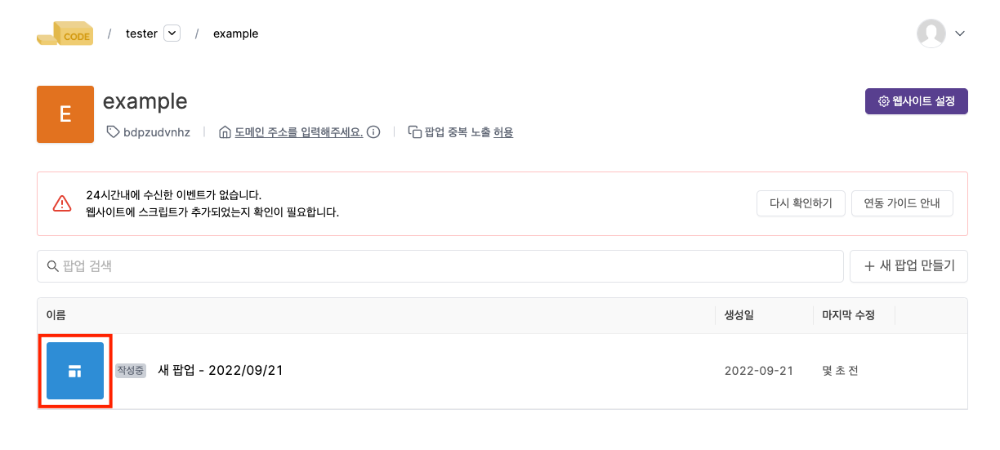
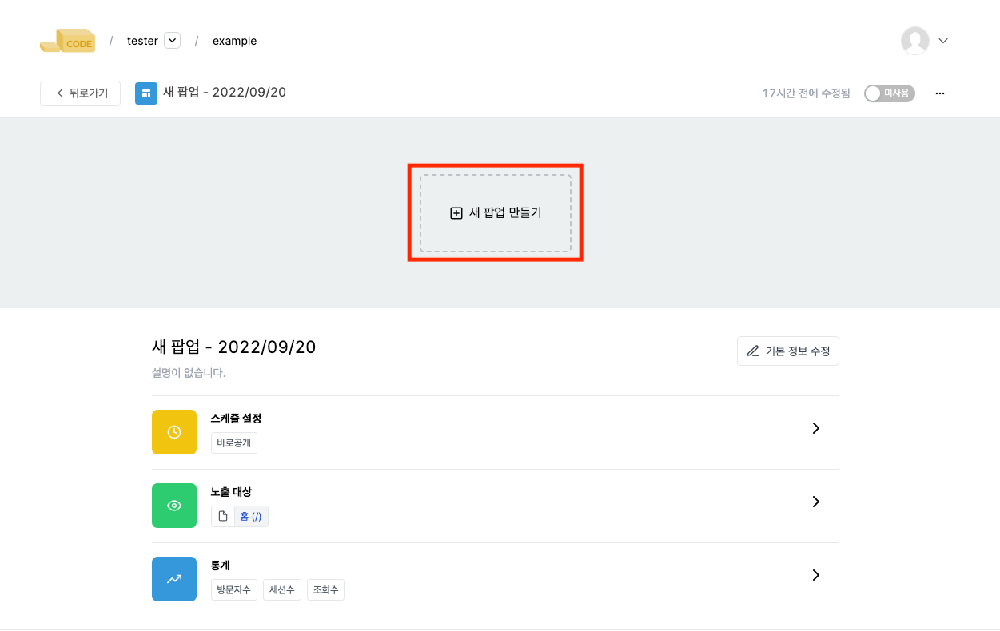
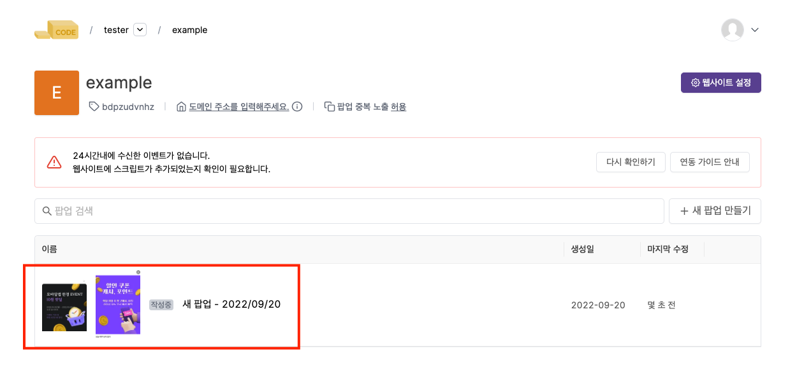
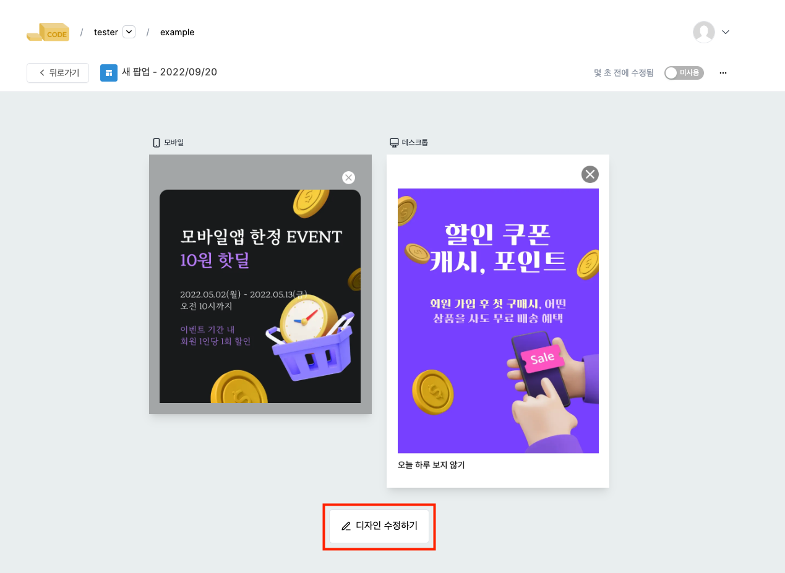

---
head:
  - - meta
    - property: "og:url"
      content: https://docs.codenbutter.com/guide/enter-editor.html
  - - meta
    - name: "twitter:url"
      content: https://docs.codenbutter.com/guide/enter-editor.html
  - - meta
    - property: "og:description"
      content: 코드앤버터 에디터 진입
  - - meta
    - name: "twitter:description"
      content: 코드앤버터 에디터 진입
---

# 에디터 진입

- 에디터로 진입하는 방법은 다양한 경로를 통해 접근할 수 있습니다.
- 상황에 따른 에디터 진입 방법에 대해 알아볼게요.

 

> [[toc]]

## 캠페인을 처음 생성하는 경우

- [팀 생성 >> 사이트] 생성 단계까지 완료된 경우에는 아직 캠페인을 생성하지 않은 단계라 팝업이 존재하지 않습니다.
- 아래 캠페인 생성방법 알아보기를 눌러 캠페인 생성 과정을 따라와주세요.
- 캠페인을 생성하는 과정에서 에디터 화면으로 자연스럽게 진입하게 됩니다.

> [캠페인 생성방법 알아보기](./create-campaign#캠페인)

## 캠페인은 존재하나 팝업이 만들어지지 않은 경우

- 이 경우, 팝업이 이미 존재하는 경우와 다르게 기본 이미지 형태로 노출됩니다.
- 기본 이미지를 눌러주세요.

- 새 팝업 만들기를 눌러주세요.

## 팝업이 이미 존재하는 경우

- 사이트 목록 페이지에서 기존에 만들어져 있는 캠페인을 선택합니다.

- 하단에 디자인 수정하기 버튼을 눌러주세요.

## 다음 과정이 궁금해요

> [팝업 디자인하는 방법 알아보기](./detail-editor.md)
