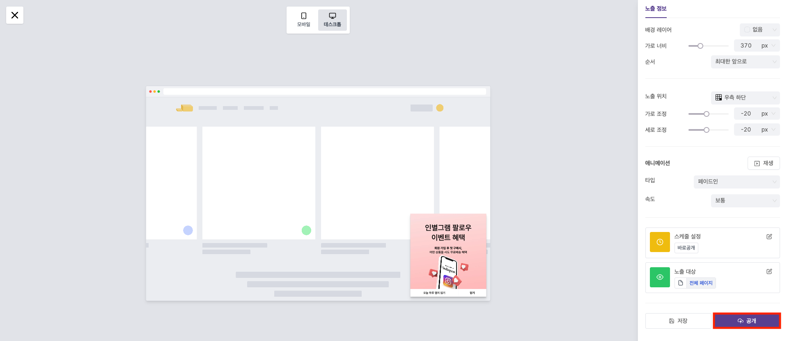
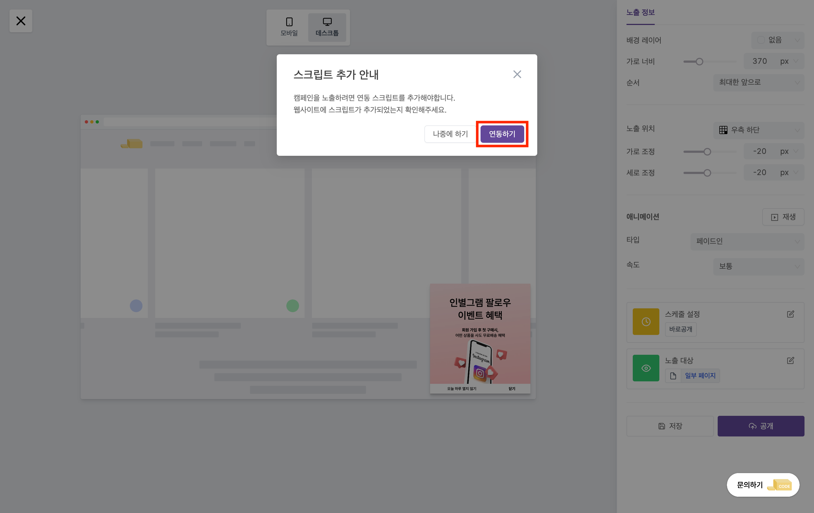
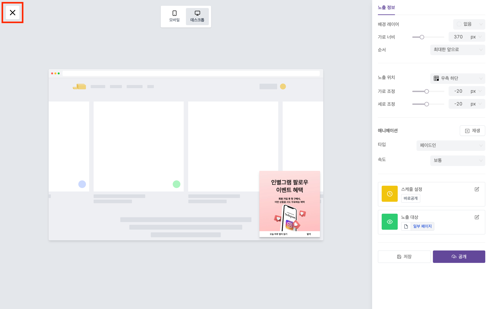
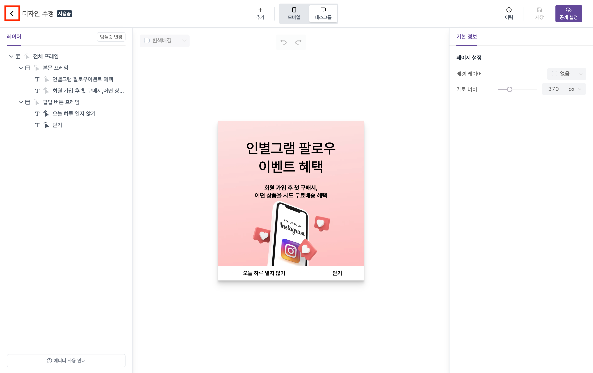
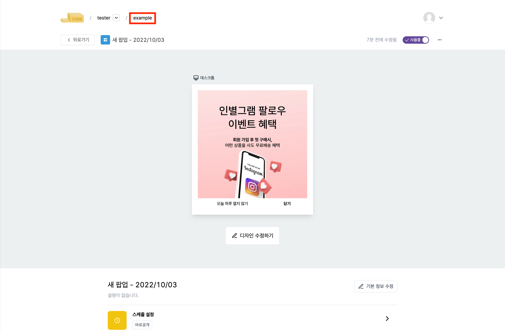
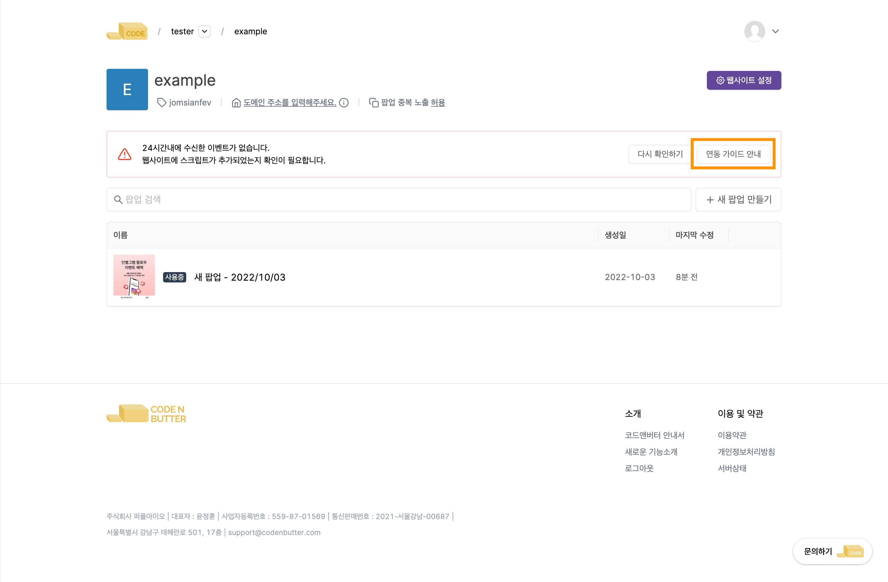
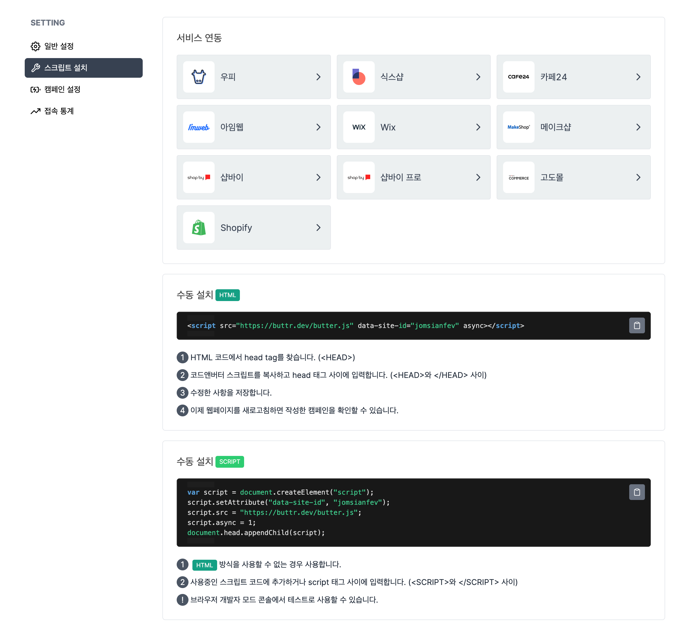
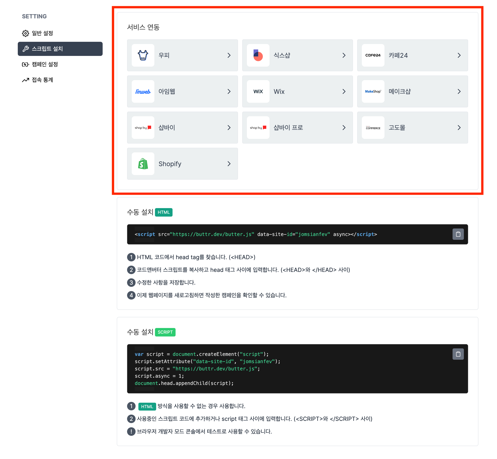
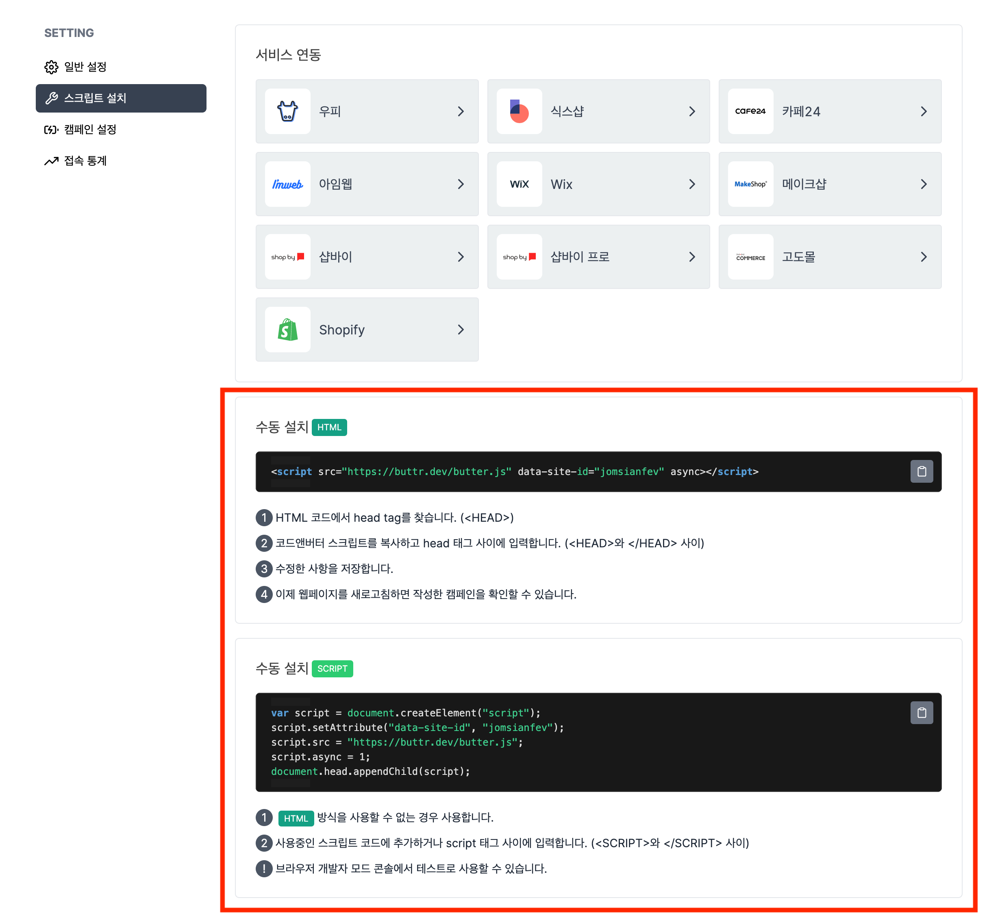

---
head:
  - - meta
    - property: "og:url"
      content: https://docs.codenbutter.com/guide/install-script.html
  - - meta
    - name: "twitter:url"
      content: https://docs.codenbutter.com/guide/install-script.html
  - - meta
    - property: "og:description"
      content: 코드앤버터 스크립트 설치
  - - meta
    - name: "twitter:description"
      content: 코드앤버터 스크립트 설치
---

# 스크립트 설치

::: info

코드앤버터 서비스를 정상적으로 이용하기 위해서는 웹사이트에 스크립트가 설치되어야 합니다.

:::

## 공개

1. [공개 설정]을 눌러 미리보기 화면으로 이동합니다.

2. 우측 하단에 위치한 [공개]를 누릅니다.

3. 안내창에서 [연동하기]를 누릅니다.

::: details 안내창이 나타나지 않아요

팝업 만드는 과정을 이미 진행했던 사용자라면 안내창이 화면에 나타나지 않을 수 있습니다.  
이 경우, 스크립트 설치 과정을 진행하고 싶다면 아래 과정을 따라와주세요.

1. 미리보기 화면에서 [닫기]를 누릅니다.

2. [뒤로가기]를 눌러 에디터 화면에서 빠져나옵니다.

3. 표시한 영역을 눌러 캠페인 목록 페이지로 이동합니다.

3. [연동 가이드 안내]를 눌러 스크립트 설치 페이지로 이동합니다.

:::

4. 스크립트 설치 페이지로 이동됩니다.

## 외부 서비스 연동

- 표시한 영역을 누르면 각 서비스에 맞는 스크립트 설치 방법을 안내해줍니다.

## 수동 설치

- 서비스 연동에 나온 목록에 해당하지 않거나 자체적으로 구축한 웹사이트를 사용하고 계신 경우에는 수동 설치를 이용해주시면 됩니다.
- 일반적인 환경의 경우 HTML 방식의 스크립트 코드를 이용하시면 됩니다.

