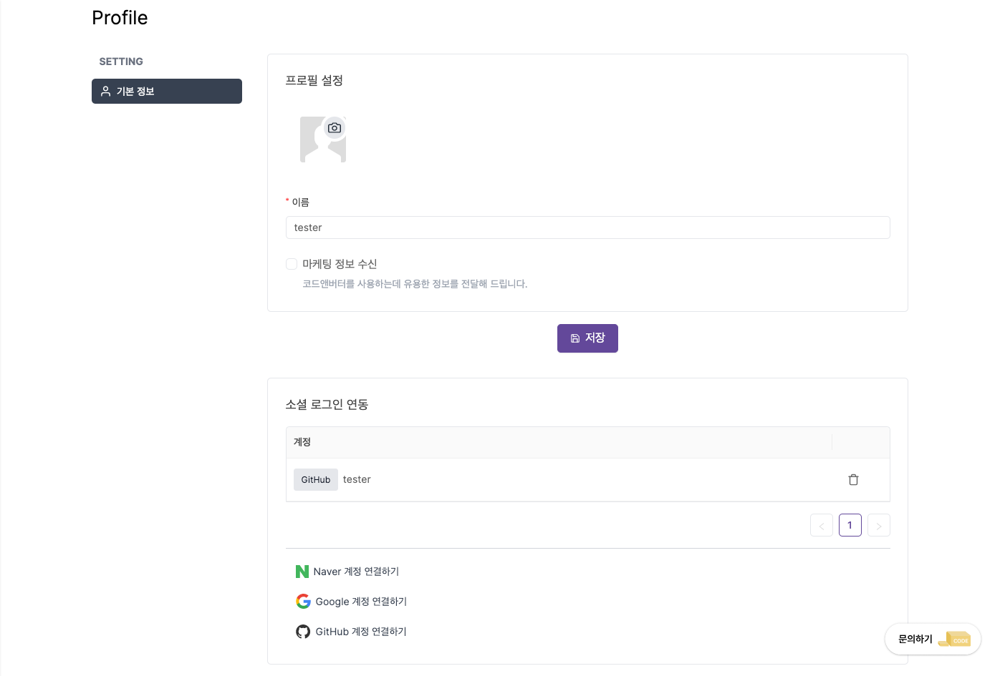

---
head:
  - - meta
    - property: "og:url"
      content: https://docs.codenbutter.com/guide/team.html
  - - meta
    - name: "twitter:url"
      content: https://docs.codenbutter.com/guide/team.html
  - - meta
    - property: "og:description"
      content: 코드앤버터 개인정보 변경
  - - meta
    - name: "twitter:description"
      content: 코드앤버터 개인정보 변경
---

# 개인정보 변경

1. 우측 상단의 프로필 아이콘을 눌러줍니다.

2. 서브메뉴에서 내 프로필을 눌러줍니다.

3.  개인정보를 변경 할 수 있는 페이지로 이동됩니다.

## 프로필 변경

- 프로필 아이콘을 누른 후 이미지를 업로드하고 나서 저장 버튼을 눌러줍니다.

## 계정 변경

- 휴지통 아이콘을 누르면 기존에 연결되었던 계정이 연동 해제가 됩니다.
- 하단에 계정 연결하기를 통해 로그인시 연동되는 계정을 변경할 수 있습니다.

::: warning 계정 연동 해제 주의사항

::: details 자세히 알아보기

### 현상

계정 연동 해제하게 되면 소셜 로그인 이용시 동일한 방식의 로그인을 누를 때,  
"동일한 이메일 계정이 존재합니다." 라는 경고문이 뜨면서 로그인이 되지 않습니다.

### 해결방법

- 위와 같은 경우가 발생하는 경우, 이메일로 로그인을 사용하면 입력한 메일 주소로 매직링크가 전달되고 다시 로그인이 가능해집니다.

- 개인정보 페이지에 진입 후, 사용하고자하는 소셜 로그인을 선택 후 계정 연결하기를 눌러주면 다시 로그인할 때 경고문이 뜨지 않습니다.

:::
