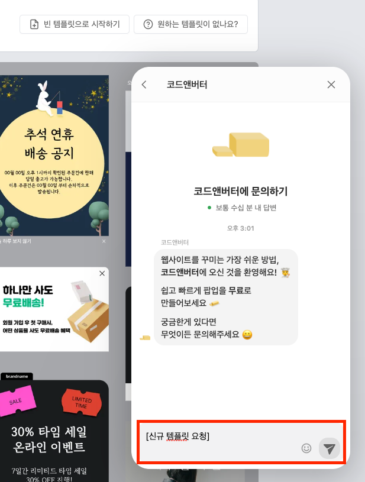

---
head:
  - - meta
    - property: "og:url"
      content: https://docs.codenbutter.com/guide/select-template.html
  - - meta
    - name: "twitter:url"
      content: https://docs.codenbutter.com/guide/select-template.html
  - - meta
    - property: "og:description"
      content: 코드앤버터 템플릿 선택
  - - meta
    - name: "twitter:description"
      content: 코드앤버터 템플릿 선택
---

# 템플릿 선택

- 팝업을 만드는 방법은 크게 템플릿을 선택하는 방법과 빈 템플릿을 선택하는 방법이 있습니다.

  > 템플릿 이용:  
  > 템플릿은 이미 만들어져있는 팝업 레이아웃을 적용하는 것으로 퀄리티 높은 디자인과 다양한 주제의 팝업들을 제공하기 때문에 컨텐츠 내용만 변경해도 간단하고 빠르게 팝업을 만들 수 있습니다.    
  > 빈 템플릿 이용:  
  > 사용자가 직접 템플릿을 한땀한땀 구성해나가는 것으로 팝업을 맞춤형 제작하고자 할 때, 적합한 방식입니다.

::: details 빈 템플릿을 이용한 제작과정 살펴보기

1. 빈 템플릿은 노란색으로 표기한 영역처럼 템플릿을 이용하는 경우와 다르게 [빈 영역] 존재합니다.
1. 따라서 상단에 위치한 [+ 추가] 버튼을 눌러서 필요한 요소들을 만들어주어야 합니다.

[+ 추가] 버튼을 이용해 템플릿을 제작하는 자세한 과정은 준비 중입니다. 🥰

:::

 

[[toc]]

## 디바이스 선택

- 데스크톱 이용자를 위한 팝업인지 아니면 모바일 이용자를 위한 팝업인지 선택해줍니다.
- 디바이스 선택에 따라서 제공되는 템플릿들이 달라집니다.

## 카테고리 선택

- 카테고리는 주제에 부합하는 템플릿들을 모아볼 때 사용합니다.

> 참고) 무료혜택 카테고리에서 모바일 디바이스를 선택했을 때 보여지는 템플릿들

::: warning 카테고리를 선택했는데 전에 쓰던 템플릿들을 찾을 수가 없어요 😭

::: details 자세히 알아보기

### 현상

선택된 디바이스가 모바일인지 데스크톱인지에 따라서 같은 카테고리라도 보여지는 내용이 달라집니다.

> 참고) 무료혜택 카테고리에서 데스트톱 디바이스를 선택했을 때 보여지는 템플릿들

:::

## 템플릿 제작 요청

> 마땅히 선택할만한 템플릿이지 보이지 않거나 원하는 템플릿을 제작하도록 요청하는 기능입니다.

 

1. [원하는 템플릿이 없나요?] 버튼을 눌러줍니다.

2. [원하는 템플릿이 없나요?] 버튼을 누르면 챗봇이 열리고 템플릿에 들어갔으면 하는 디자인, 내용, 기능 등 템플릿 컨셉을 작성해주고나서 전송 버튼을 눌러줍니다.

## 다음 과정이 궁금해요

> [에디터 사용 알아보기](./enter-editor.md)
