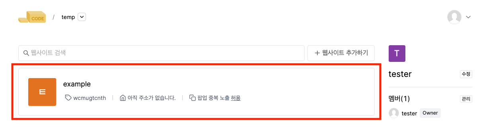
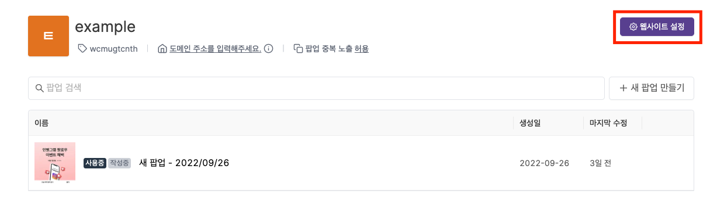
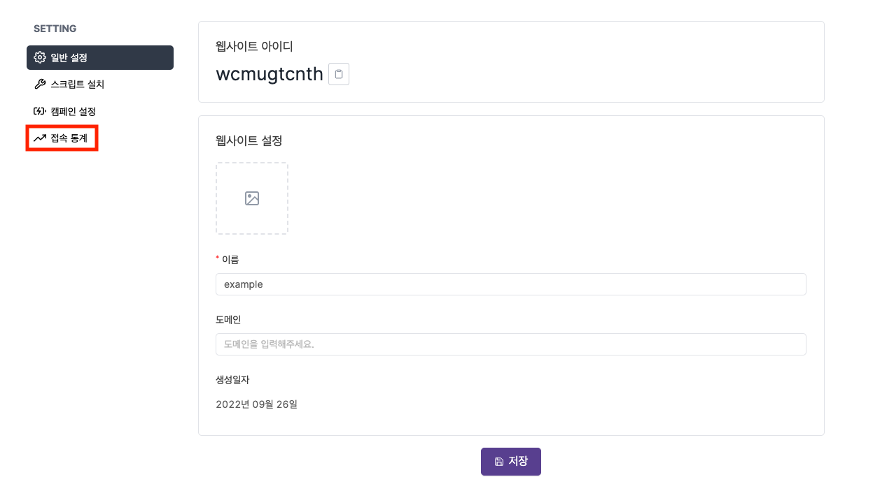
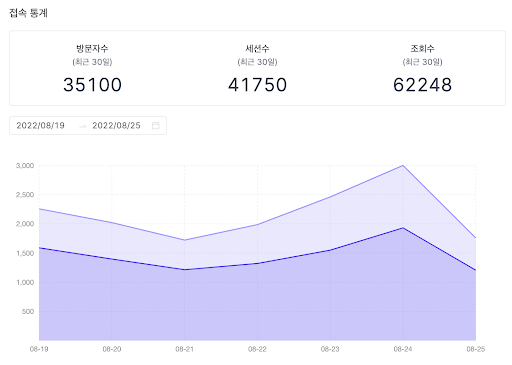
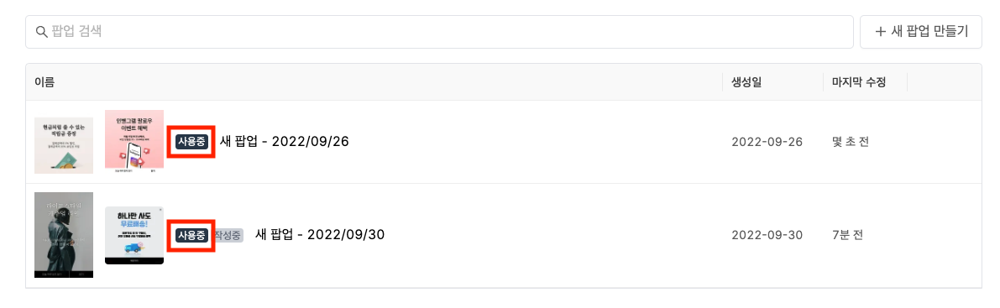
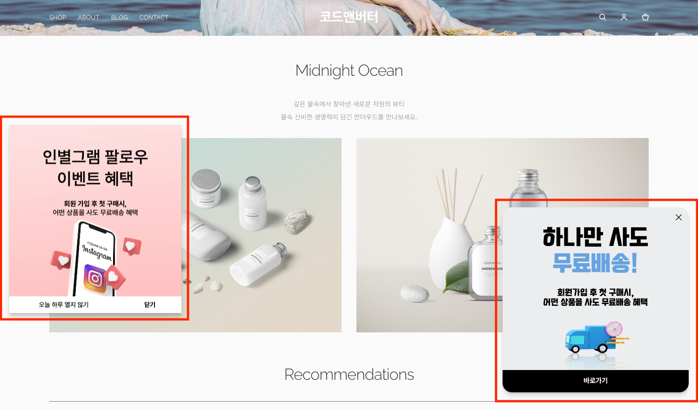
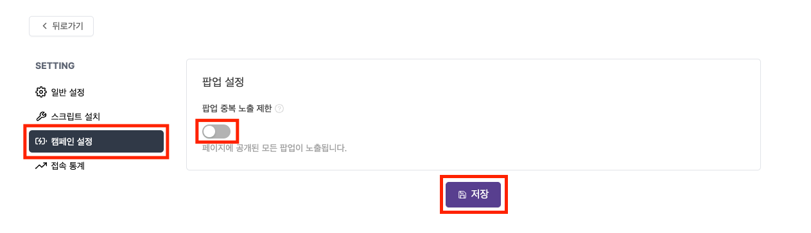
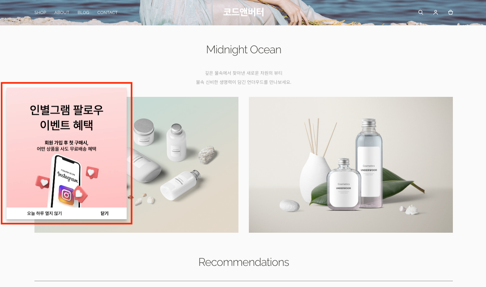
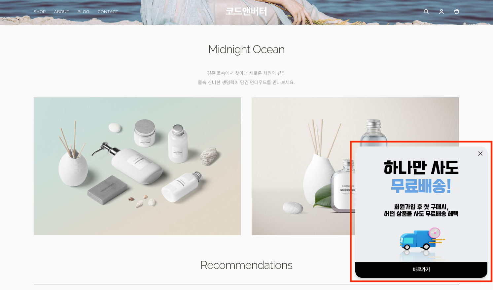

---
head:
  - - meta
    - property: "og:url"
      content: https://docs.codenbutter.com/guide/site.html
  - - meta
    - name: "twitter:url"
      content: https://docs.codenbutter.com/guide/site.html
  - - meta
    - property: "og:description"
      content: 코드앤버터 사이트
  - - meta
    - name: "twitter:description"
      content: 코드앤버터 사이트
---

# 사이트

::: info

팝업을 노출할 사이트를 의미합니다.

:::

## 통계

1. 메인화면에서 통계 데이터를 확인하고 싶은 사이트를 목록에서 선택해줍니다.

2. 웹사이트 설정을 눌러주세요.

3. 접속 통계를 눌러주세요.

4. 사이트 접속 통계가 보여집니다.

 

::: info 통계 지표

- 통계 지표가 어떤 의미인지 알고 싶다면 아래 내용을 참고해주세요.

[통계 자료 해석하기](./campaign.md#방문자수-vs-세션수-vs-조회수-무엇이-다른가요)

:::

## 팝업 랜덤 노출

- 여러 개의 팝업이 동시에 사용중인 상태가 되어있다면 사이트에 여러개의 팝업이 노출되게 됩니다.

- 이런 경우에 팝업이 중복 노출되지 않도록 제한하는 동시에 사이트에 접속할 때마다 랜덤으로 팝업을 노출시킬 수 있습니다.

1. 메인화면에서 중복 노출을 피하고 싶은 사이트를 목록에서 선택해줍니다.

2. 메뉴에서 캠페인 설정을 눌러주세요.

3. 팝업 중복 노출 제한 아이콘을 누르고 저장 버튼을 눌러주세요.

4. 사이트에 접속해보면 하나의 팝업만 노출되는 것을 보실 수 있습니다.

5. 사이트에 접속할 때마다 랜덤하게 팝업이 노출 됩니다.

::: info 팝업 비활성화

- 팝업 랜덤 노출이 아니라 팝업을 비활성화하고 싶다면 아래 내용을 참고해주세요.

[팝업 비활성화](./detail-editor.md#사용-중지)

:::
