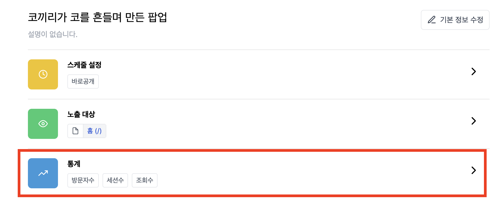

---
head:
  - - meta
    - property: "og:url"
      content: https://docs.codenbutter.com/guide/site.html
  - - meta
    - name: "twitter:url"
      content: https://docs.codenbutter.com/guide/site.html
  - - meta
    - property: "og:description"
      content: 코드앤버터 사이트
  - - meta
    - name: "twitter:description"
      content: 코드앤버터 사이트
---

# 사이트 (TODO)

::: info

팝업을 노출할 사이트를 의미합니다.

:::

스크립트 설치 / 팝업 중복 노출 제한 / 접속 통계

<!-- 캠페인 통계 참조 -->
<!-- ## 통계

1. 캠페인 상세 페이지에서 하단에 위치한 [통계]를 눌러줍니다.

2. 캠페인 접속 통계가 보여집니다.

 -->
