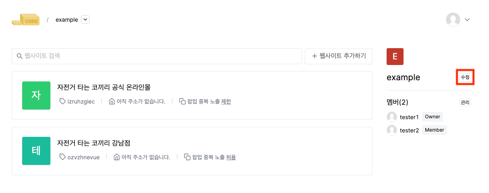
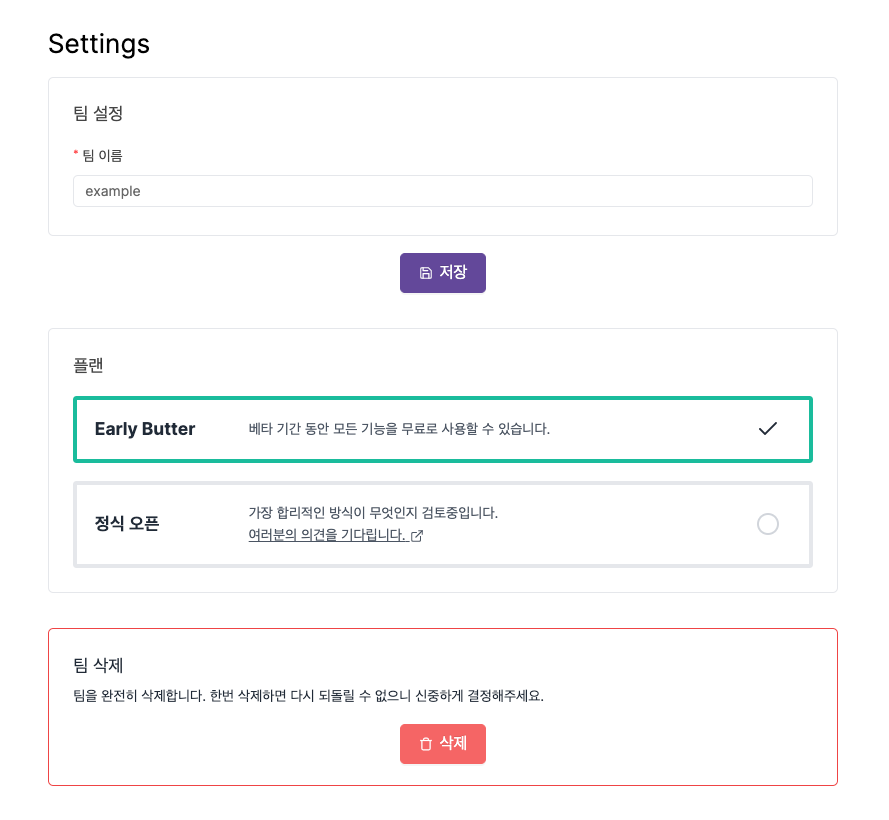

---
head:
  - - meta
    - property: "og:url"
      content: https://docs.codenbutter.com/guide/team.html
  - - meta
    - name: "twitter:url"
      content: https://docs.codenbutter.com/guide/team.html
  - - meta
    - property: "og:description"
      content: 코드앤버터 팀
  - - meta
    - name: "twitter:description"
      content: 코드앤버터 팀
---

# 팀 (TODO)

::: info
팀에 대한 설명 (TODO)
:::

 
멤버권한 변경 멤버삭제 추가하는 내용 필요 (TODO)

## 팀 설정

- 메인 페이지에서 우측에 있는 수정 버튼을 누르면 팀 설정을 할 수 있는 페이지로 이동합니다.
  > 팀 설정 페이지에서는 팀 이름 변경, 요금제 변경, 팀 삭제를 할 수 있습니다.

