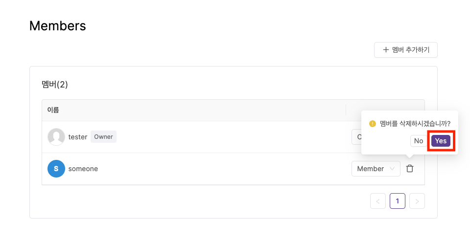

---
head:
  - - meta
    - property: "og:url"
      content: https://docs.codenbutter.com/guide/team.html
  - - meta
    - name: "twitter:url"
      content: https://docs.codenbutter.com/guide/team.html
  - - meta
    - property: "og:description"
      content: 코드앤버터 팀
  - - meta
    - name: "twitter:description"
      content: 코드앤버터 팀
---

# 팀

::: info
구성원들과 함께 협업으로 관리할 수 있는 기능들을 제공합니다.

:::

 
멤버권한 변경 멤버삭제 추가하는 내용 필요

## 팀 설정

- 메인 페이지에서 우측에 있는 수정 버튼을 누르면 팀 설정을 할 수 있는 페이지로 이동합니다.
  > 팀 설정 페이지에서는 팀 이름 변경, 요금제 변경, 팀 삭제를 할 수 있습니다.

## 멤버 추가

1. 우측 영영에서 [관리]를 누릅니다.

2. 멤버 관리 페이지로 이동 후, [멤버 추가하기]를 누릅니다.

3. 모달창이 뜬 상태에서 추가할 멤버의 이메일을 입력한 후, [추가하기] 버튼을 누릅니다.

::: warning 주의사항

코드앤버터 서비스에 로그인한 적이 있는 사용자의 이메일 계정으로만 멤버로 추가할 수 있습니다.

:::

4. 새로 추가한 멤버가 목록에 나타납니다.

## 멤버 삭제

1. 멤버 목록에서 삭제할 대상의 삭제 아이콘을 누릅니다.

2. [Yes]를 누르면 멤버 목록에서 지워집니다.

## 멤버 권한 변경

- 멤버 권한은 Owner와 Member가 존재합니다.
- 하나의 팀에서 여러명이 Owner가 될 수 있으며 Owner는 멤버 추가, 멤버 권한 변경, 멤버 삭제, 팀 이름 변경 등 다양한 권한을 가집니다.

::: warning 주의사항

본인을 OWner에서 Member로 변경하는 경우, 축소된 권한으로 인해 멤버 권한을 다시 바꿀 수 없게되니 주의가 필요합니다.

:::

1. 멤버 목록에서 삭제할 대상의 [삭제] 아이콘을 누릅니다.

2. 변경하고자하는 권한의 내용을 선택합니다.

3. 변경된 권한이 목록에서 적용되어 나타납니다.

